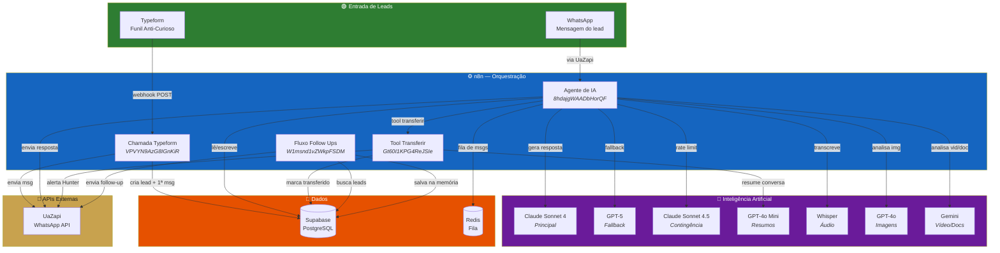
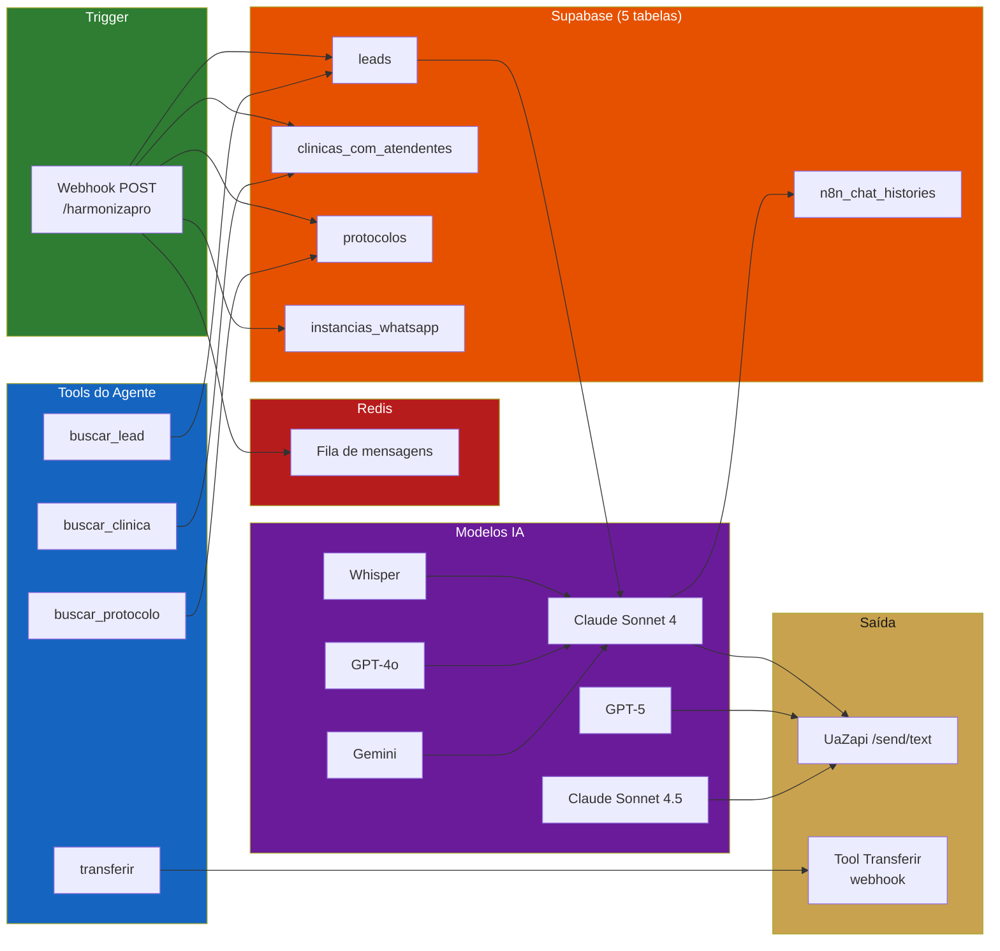
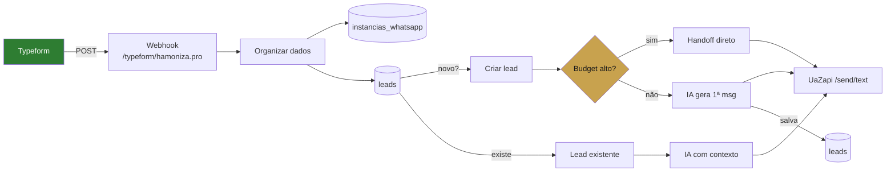
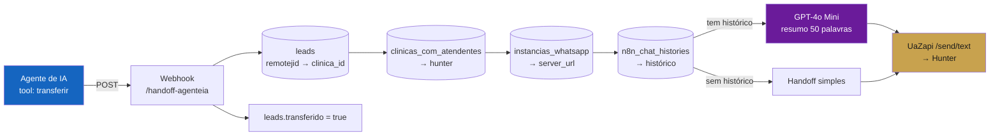
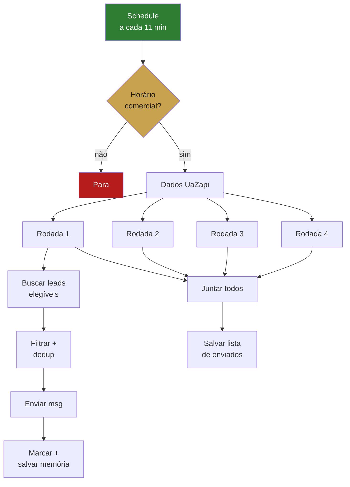

# Mapa de Dependências

> Visão completa de como cada componente do sistema se conecta. Use estes diagramas para entender o impacto de qualquer mudança.

---

## Visão Geral do Sistema

---

## Dependências por Workflow

### Agente de IA — o mais complexo

---

### Chamada Typeform

---

### Tool Transferir

---

### Fluxo Follow Ups

---

## Matriz de Dependências

Referência rápida: se algo quebrar, saiba o que é afetado.

### Se uma API cair...

| API fora do ar | Workflows afetados | Impacto | Severidade |
|:---------------|:-------------------|:--------|:-----------|
| **UaZapi** | Todos | Nenhuma mensagem é enviada/recebida | 🔴 Crítico |
| **Supabase** | Todos | Sem dados de leads, clínicas, memória | 🔴 Crítico |
| **Redis** | Agente de IA | Fila de mensagens para de funcionar, respostas duplicadas | 🟡 Alto |
| **Anthropic (Claude)** | Agente de IA | IA principal cai, fallback para GPT-5 | 🟡 Alto |
| **OpenAI** | Agente de IA, Chamada Typeform, Tool Transferir | GPT-5 fallback cai, Whisper para, resumos param | 🟡 Alto |
| **Google (Gemini)** | Agente de IA | Análise de vídeo e documentos para | 🟢 Médio |
| **Typeform** | Chamada Typeform | Novos leads não entram (mas existentes continuam) | 🟢 Médio |

### Se uma tabela Supabase for comprometida...

| Tabela | Leitura por | Escrita por | Se cair |
|:-------|:-----------|:-----------|:--------|
| `leads` | Agente, Typeform, Transferir, Follow Ups | Typeform, Agente, Transferir | Nenhum workflow funciona |
| `clinicas_com_atendentes` | Agente, Typeform, Transferir | — (manual) | Agente não sabe de qual clínica é o lead |
| `protocolos` | Agente, Typeform | — (manual) | Agente perde personalização por clínica |
| `n8n_chat_histories` | Agente, Transferir | Agente, Follow Ups | IA perde memória, handoff sem resumo |
| `instancias_whatsapp` | Agente, Typeform, Transferir | — (manual) | Sem URL/token do WhatsApp |

### Comunicação entre workflows

| De | Para | Método | Dado trafegado |
|:---|:-----|:-------|:---------------|
| Chamada Typeform | Agente de IA | Indireto (lead criado no Supabase) | `clinica_id`, `instancia_id`, dados do Typeform |
| Agente de IA | Tool Transferir | HTTP POST webhook | `telefone`, `motivo` |
| Tool Transferir | Agente de IA | Indireto (`leads.transferido = true`) | Flag que para o agente |
| Fluxo Follow Ups | Agente de IA | Indireto (msg salva em `n8n_chat_histories`) | Contexto de follow-up na memória |

---

## Credenciais Compartilhadas

| Credential | Serviço | Usada em |
|:-----------|:--------|:---------|
| `ferramentas@harmoniza.pro` (Supabase) | Supabase | Todos os 4 workflows |
| `ferramentas@harmoniza.pro` (Anthropic) | Claude API | Agente de IA, Chamada Typeform |
| `ferramentas@harmoniza.pro` (OpenAI) | OpenAI API | Agente de IA, Chamada Typeform, Tool Transferir |
| `ferramentas@harmoniza.pro` (Google) | Gemini API | Agente de IA |
| `ferramentas@harmoniza.pro` (Redis) | Redis | Agente de IA |
| `ferramentas@harmoniza.pro (Agente IA)` (Postgres) | PostgreSQL direto | Agente de IA (memória) |

!!! warning "Ponto único de falha"
    Todas as credenciais estão sob `ferramentas@harmoniza.pro`. Se essa conta for comprometida ou expirar, **todos os workflows param**. Considere separar credenciais por serviço ou ter backup.
