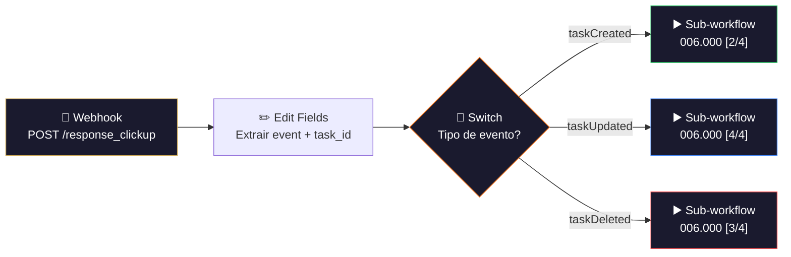

# 🎛️ 006.000 [1/4] — Formulários: Central de Automações

!!! info "Visão Geral"
    Dispatcher central que recebe webhooks do ClickUp para eventos de tasks (created, updated, deleted) na lista de formulários e roteia para o sub-workflow correspondente. Funciona como a "entrada única" do sistema de sincronização formulários ↔ banco de dados.

## Ficha Técnica

| Campo | Valor |
|:------|:------|
| **Nome** | 006.000 - [1/4] - Formulários - Central de Automações |
| **ID** | `pbG9ISoQItocO8A6` |
| **Instância** | `workflows.goldeletra.pro` |
| **Status** | 🟢 Ativo |
| **Nós** | 7 |
| **Trigger** | Webhook POST `/response_clickup` |
| **Dependências** | ClickUp (webhook nativo), Sub-workflows 2/4, 3/4, 4/4 |

---

## Arquitetura



---

## Nós em Detalhe

### 1. Webhook
**Tipo:** `webhook` v2.1

| Parâmetro | Valor |
|:----------|:------|
| **Método** | POST |
| **Path** | `/response_clickup` |
| **URL completa** | `https://webhooks.goldeletra.pro/webhook/response_clickup` |

Recebe o payload do webhook nativo do ClickUp (não é o ClickUp Trigger do n8n — é um webhook registrado via API).

### 2. HTTP Request1 (auxiliar)
Endpoint para listar/gerenciar webhooks registrados no ClickUp:
```
GET https://api.clickup.com/api/v2/team/90132992412/webhook
```

### 3. Edit Fields
Extrai os campos essenciais do payload:

| Campo | Expressão |
|:------|:----------|
| `event` | `body.event` (taskCreated / taskUpdated / taskDeleted) |
| `task_id` | `body.task_id` |

### 4. Switch
Roteia baseado no tipo de evento:

| Evento | Sub-workflow | ID |
|:-------|:-------------|:---|
| `taskCreated` | 006.000 [2/4] — TaskCreated | `kastfiC5DE6IdNUd` |
| `taskUpdated` | 006.000 [4/4] — TaskUpdated | `HVMQTCfVDbSFnQJt` |
| `taskDeleted` | 006.000 [3/4] — TaskDeleted | `jGfoGDdLSD7uJlww` |

### 5–7. Execute Workflow (3 nós)
Cada um chama o sub-workflow correspondente com `waitForSubWorkflow: false` (fire-and-forget).

---

## Mapa do Sistema

```
[1/4] Central      → Recebe webhook, roteia por evento
  ├── [2/4] Created → Insere resposta no banco
  ├── [3/4] Deleted → Remove resposta do banco
  └── [4/4] Updated → Atualiza resposta no banco
```

---

## Credenciais

| Serviço | Credencial | Uso |
|:--------|:-----------|:----|
| ClickUp | `ClickUp - Ferramentas` | Gerenciar webhooks (HTTP Request) |

---

## Troubleshooting

| Problema | Causa | Solução |
|:---------|:------|:--------|
| Webhook não recebe | Webhook desregistrado no ClickUp | Re-registrar via API |
| Switch não roteia | Evento desconhecido | Verificar `body.event` no payload |
| Sub-workflow não executa | ID do workflow alterado | Atualizar IDs nos nós Execute Workflow |