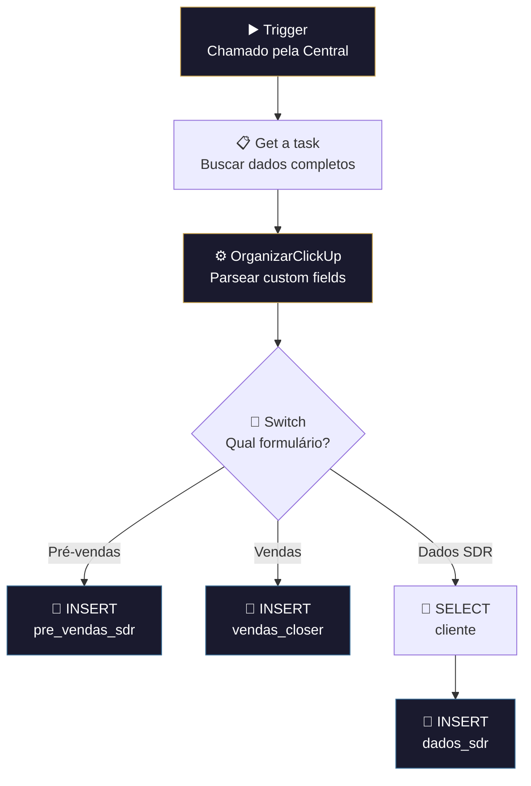

# ➕ 006.000 [2/4] — Formulários: TaskCreated

!!! info "Visão Geral"
    Sub-workflow que processa novas tasks criadas na lista de formulários do ClickUp. Busca os dados completos da task, identifica qual formulário foi preenchido (Pré-vendas SDR, Vendas Closer ou Dados SDR) e insere as respostas na tabela PostgreSQL correspondente.

## Ficha Técnica

| Campo | Valor |
|:------|:------|
| **Nome** | 006.000 - [2/4] - Formulários - TaskCreated |
| **ID** | `kastfiC5DE6IdNUd` |
| **Instância** | `workflows.goldeletra.pro` |
| **Status** | 🔴 Inativo (chamado por sub-workflow) |
| **Nós** | 8 |
| **Trigger** | Execute Workflow Trigger (passthrough) |
| **Chamado por** | 006.000 [1/4] — Central |
| **Dependências** | ClickUp, PostgreSQL |

---

## Arquitetura

---

## Fluxo Detalhado

### 1. Trigger
Recebe `event` e `task_id` do workflow Central via passthrough.

### 2. Get a task
Busca dados completos da task no ClickUp (incluindo custom fields).

### 3. OrganizarClickUp
Parser padrão de custom fields (template 005.001).

### 4. Switch — Tipo de formulário
Identifica qual formulário foi preenchido e roteia para a tabela correta:

| Rota | Tabela PostgreSQL | Descrição |
|:-----|:------------------|:----------|
| Pré-vendas | `pre_vendas_sdr` | Respostas do formulário de pré-vendas (SDR) |
| Vendas | `vendas_closer` | Respostas do formulário de vendas (Closer) |
| Dados SDR | `dados_sdr` | Dados complementares do SDR (via tabela `cliente`) |

### 5. Insert
Insere os dados do formulário na tabela correspondente. Para `dados_sdr`, primeiro busca dados do cliente na tabela `cliente` antes de inserir.

---

## Tabelas PostgreSQL

| Tabela | Operação | Descrição |
|:-------|:---------|:----------|
| `pre_vendas_sdr` | INSERT | Formulário de pré-vendas |
| `vendas_closer` | INSERT | Formulário de vendas |
| `cliente` | SELECT | Busca dados do cliente (auxiliar) |
| `dados_sdr` | INSERT | Dados complementares do SDR |

---

## Credenciais

| Serviço | Credencial |
|:--------|:-----------|
| ClickUp | `ClickUp - Ferramentas` |
| PostgreSQL | `Metricas - Clientes` |

---

## Troubleshooting

| Problema | Causa | Solução |
|:---------|:------|:--------|
| Insert falha com unique constraint | Task já processada | Verificar se é reprocessamento |
| Switch não roteia | Tipo de formulário desconhecido | Verificar custom fields da task |
| Dados incompletos | Custom fields vazios | Checar preenchimento no ClickUp |