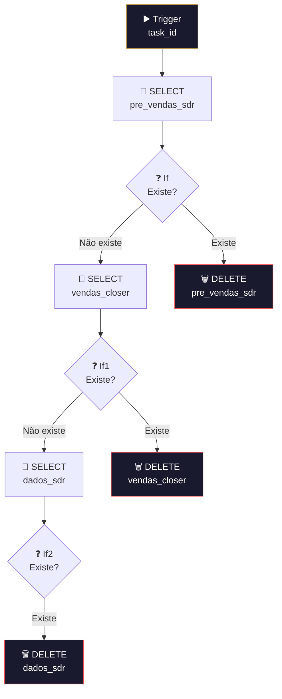

# 🗑️ 006.000 [3/4] — Formulários: TaskDeleted

!!! info "Visão Geral"
    Sub-workflow que processa exclusão de tasks na lista de formulários. Percorre sequencialmente as 3 tabelas do banco (pre_vendas_sdr → vendas_closer → dados_sdr), verifica se a task existe em cada uma e deleta quando encontrada. Garante que dados órfãos não fiquem no banco.

## Ficha Técnica

| Campo | Valor |
|:------|:------|
| **Nome** | 006.000 - [3/4] - Formulários - TaskDeleted |
| **ID** | `jGfoGDdLSD7uJlww` |
| **Instância** | `workflows.goldeletra.pro` |
| **Status** | 🔴 Inativo (chamado por sub-workflow) |
| **Nós** | 10 |
| **Trigger** | Execute Workflow Trigger (passthrough) |
| **Chamado por** | 006.000 [1/4] — Central |
| **Dependências** | PostgreSQL |

---

## Arquitetura

---

## Fluxo Detalhado

O workflow usa uma estratégia de **busca sequencial**: como não sabe em qual tabela a task está, percorre as 3 tabelas na ordem até encontrar e deletar.

### Passo 1 — pre_vendas_sdr
1. **SELECT** da tabela `pre_vendas_sdr` WHERE `task_id` = valor recebido
2. **If** — se `id` não existe → segue para próxima tabela. Se existe → **DELETE**

### Passo 2 — vendas_closer
1. **SELECT** da tabela `vendas_closer` WHERE `task_id`
2. **If1** — mesma lógica: não encontrou → próxima tabela. Encontrou → **DELETE**

### Passo 3 — dados_sdr
1. **SELECT** da tabela `dados_sdr` WHERE `task_id`
2. **If2** — encontrou → **DELETE**. Não encontrou → fim (task não existia em nenhuma tabela)

---

## Tabelas Afetadas

| Tabela | Operação | Condição |
|:-------|:---------|:---------|
| `pre_vendas_sdr` | SELECT → DELETE | `WHERE task_id = :task_id` |
| `vendas_closer` | SELECT → DELETE | `WHERE task_id = :task_id` |
| `dados_sdr` | SELECT → DELETE | `WHERE task_id = :task_id` |

---

## Credenciais

| Serviço | Credencial |
|:--------|:-----------|
| PostgreSQL | `Metricas - Clientes` |

---

## Troubleshooting

| Problema | Causa | Solução |
|:---------|:------|:--------|
| Task não deletada | Não existe em nenhuma tabela | Normal — pode ter sido deletada manualmente |
| DELETE falha | Constraint de FK | Verificar relações entre tabelas |
| Workflow não executa | Central não roteou | Verificar Switch na [1/4] |