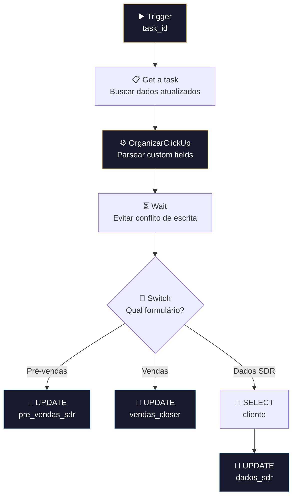

# ✏️ 006.000 [4/4] — Formulários: TaskUpdated

!!! info "Visão Geral"
    Sub-workflow que processa atualizações de tasks na lista de formulários. Busca os dados atualizados da task no ClickUp, identifica o tipo de formulário e faz UPDATE na tabela PostgreSQL correspondente. Inclui um Wait para evitar conflitos com escritas simultâneas.

## Ficha Técnica

| Campo | Valor |
|:------|:------|
| **Nome** | 006.000 - [4/4] - Formulários - TaskUpdated |
| **ID** | `HVMQTCfVDbSFnQJt` |
| **Instância** | `workflows.goldeletra.pro` |
| **Status** | 🔴 Inativo (chamado por sub-workflow) |
| **Nós** | 9 |
| **Trigger** | Execute Workflow Trigger (passthrough) |
| **Chamado por** | 006.000 [1/4] — Central |
| **Dependências** | ClickUp, PostgreSQL |

---

## Arquitetura

---

## Fluxo Detalhado

### 1. Trigger
Recebe `event` e `task_id` do workflow Central.

### 2. Get a task
Busca a task completa e atualizada no ClickUp.

### 3. OrganizarClickUp
Parser padrão de custom fields (template 005.001).

### 4. Wait
Delay entre o parse e o Switch. Previne race conditions quando múltiplas atualizações chegam em sequência rápida (ex: ClickUp dispara vários eventos ao salvar um formulário).

### 5. Switch — Tipo de formulário
Mesmo roteamento do [2/4] TaskCreated:

| Rota | Tabela | Operação |
|:-----|:-------|:---------|
| Pré-vendas | `pre_vendas_sdr` | UPDATE |
| Vendas | `vendas_closer` | UPDATE |
| Dados SDR | `dados_sdr` | UPDATE (via tabela `cliente`) |

### 6. Update
Atualiza os campos na tabela correspondente usando `task_id` como chave.

Para `dados_sdr`, primeiro busca dados complementares na tabela `cliente` antes de atualizar.

---

## Comparação com [2/4] TaskCreated

| Aspecto | [2/4] Created | [4/4] Updated |
|:--------|:--------------|:--------------|
| **Operação SQL** | INSERT | UPDATE |
| **Wait** | Não | Sim (evita race condition) |
| **Roteamento** | Idêntico | Idêntico |
| **Parser** | OrganizarClickUp | OrganizarClickUp |
| **Tabela auxiliar** | `cliente` (SELECT) | `cliente` (SELECT) |

---

## Tabelas PostgreSQL

| Tabela | Operação | Condição |
|:-------|:---------|:---------|
| `pre_vendas_sdr` | UPDATE | `WHERE task_id = :task_id` |
| `vendas_closer` | UPDATE | `WHERE task_id = :task_id` |
| `cliente` | SELECT | Busca dados complementares |
| `dados_sdr` | UPDATE | `WHERE task_id = :task_id` |

---

## Credenciais

| Serviço | Credencial |
|:--------|:-----------|
| ClickUp | `ClickUp - Ferramentas` |
| PostgreSQL | `Metricas - Clientes` |

---

## Troubleshooting

| Problema | Causa | Solução |
|:---------|:------|:--------|
| UPDATE não afeta nenhuma row | Task nunca foi inserida (evento Created perdido) | Executar [2/4] manualmente ou inserir via SQL |
| Dados desatualizados | Race condition entre eventos | Aumentar tempo no nó Wait |
| Switch não roteia | Tipo de formulário mudou | Verificar custom fields da task |