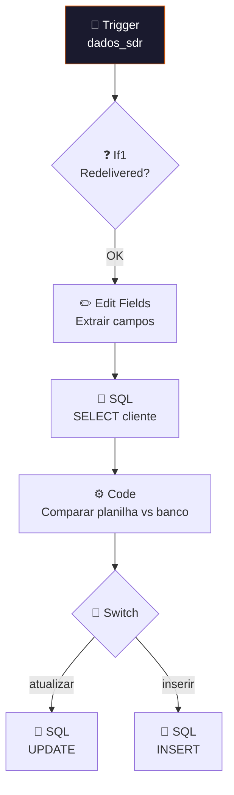

# 🔄 001.014 — Postgres: Atualizar Dados Cliente

!!! info "Visão Geral"
    Worker que consome da fila `dados_sdr` e sincroniza dados de clientes entre planilha e banco PostgreSQL. Compara campos, gera query dinâmica (INSERT ou UPDATE) e executa. Lógica inteligente que detecta diferenças antes de atualizar.

## Ficha Técnica

| Campo | Valor |
|:------|:------|
| **ID** | `4L3UoZGFAsWofZYx` |
| **Status** | 🟢 Ativo |
| **Nós** | 9 |
| **Trigger** | RabbitMQ — fila `dados_sdr` |

---

## Fluxo

### Lógica do Code (Comparação Inteligente)
- Se registro não existe → gera INSERT
- Se existe e dados iguais → skip (sem query)
- Se existe e dados diferentes → gera UPDATE apenas dos campos alterados

## Fila

| Fila | Publisher |
|:-----|:---------|
| `dados_sdr` | 001.015 — Dashboard |

## Credenciais

| Serviço | Credencial |
|:--------|:-----------|
| RabbitMQ | `RabbitMQ` |
| PostgreSQL | `Metricas - Clientes` |