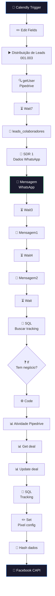

# 📅 001.002 — Calendly: Event Create

!!! info "Visão Geral"
    Workflow principal que processa agendamentos do Calendly. Distribui leads entre SDRs, atualiza Pipedrive, dispara eventos para Facebook Pixel (CAPI), envia mensagens WhatsApp de confirmação e cria atividades no CRM. O mais complexo da pasta Comercial com 48 nós.

## Ficha Técnica

| Campo | Valor |
|:------|:------|
| **ID** | `EOeEGroKenTL6tm8` |
| **Status** | 🟢 Ativo |
| **Nós** | 48 (vários desabilitados) |
| **Trigger** | Calendly Trigger (event created) |
| **Error Workflow** | `ByxX1TqYfyvlgp2T` |
| **Tags** | `OK`, `Cadastrado` |

---

## Arquitetura

---

## Funcionalidades

### 1. Distribuição de Leads
Chama sub-workflow 001.003 para atribuir lead ao SDR correto via round-robin.

### 2. Notificação WhatsApp (3 mensagens sequenciais)
Envia ao SDR via API WhatsApp (MegaAPI/UaZapi) com delays entre mensagens.

### 3. CRM Pipedrive
Cria atividade, busca e atualiza deal com dados do agendamento.

### 4. Facebook Pixel (CAPI)
Hash SHA-256 de nome, sobrenome, email e telefone → dispara evento de conversão.

### 5. Tracking PostgreSQL
Persiste dados de tracking e atribuição no banco.

## Credenciais

| Serviço | Credencial |
|:--------|:-----------|
| Calendly | `Calendly account` |
| Pipedrive | `Pipedrive - evoluamidia@gmail.com` |
| PostgreSQL | `Postgres - Metricas` |
| WhatsApp | `Z Api` / MegaAPI |