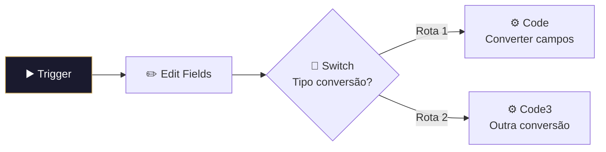

# 🔄 001.006 — Pipedrive: Conversão de Campos

!!! info "Visão Geral"
    Sub-workflow utilitário que converte IDs de campos customizados do Pipedrive para seus nomes legíveis. Busca a definição dos deal fields via API e mapeia valores. Usado pelo 001.010 e 001.011.

## Ficha Técnica

| Campo | Valor |
|:------|:------|
| **ID** | `1ZOJnFDLY7e8hV8j` |
| **Status** | 🔴 Inativo (sub-workflow) |
| **Nós** | 10 |
| **Trigger** | Execute Workflow Trigger (passthrough) |
| **Tags** | `OK`, `Cadastrado`, `Documentado` |

---

## Fluxo

Busca definição via `GET /api/v1/dealFields` e converte IDs numéricos para nomes.

## Chamado por

| Workflow | Contexto |
|:---------|:---------|
| 001.010 — Lead Score Pixel | Converter campos antes do pixel |
| 001.011 — Update Deal | Converter campos do webhook |

## Credenciais

| Serviço | Credencial |
|:--------|:-----------|
| Pipedrive | `Pipedrive - evoluamidia@gmail.com` |