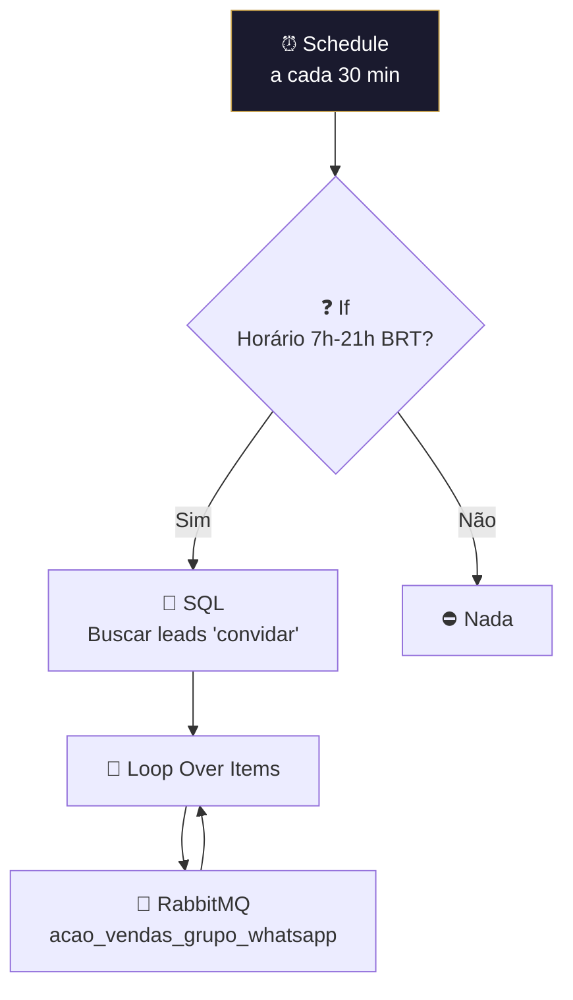

# 📩 001.007 [1/3] — Envio de Convite: Scheduler

!!! info "Visão Geral"
    Primeiro estágio do sistema de convites para eventos de vendas. Roda a cada 30 minutos, verifica horário comercial (7h-21h BRT), busca leads com status "convidar" no banco e publica na fila com timing distribuído ao longo do dia.

## Ficha Técnica

| Campo | Valor |
|:------|:------|
| **ID** | `EPj4uqLra763cKjD` |
| **Status** | 🔴 Inativo |
| **Nós** | 11 |
| **Trigger** | Schedule Trigger (30 min) |
| **Error Workflow** | `ByxX1TqYfyvlgp2T` |
| **Tags** | `OK`, `Cadastrado` |

---

## Fluxo

### SQL de Distribuição Temporal
Query avançada que distribui 10 leads linearmente entre `min_time` (4.457 min) e `max_time` (28 min), garantindo espaçamento natural entre envios.

## Fila

| Fila | Consumer |
|:-----|:---------|
| `acao_vendas_grupo_whatsapp` | 001.007 [2/3] |

## Credenciais

| Serviço | Credencial |
|:--------|:-----------|
| PostgreSQL | `Evento Vendas` |
| RabbitMQ | `RabbitMQ` |