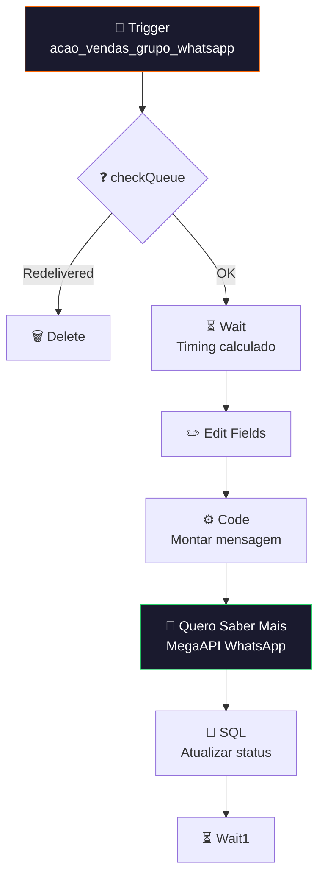

# 📨 001.007 [2/3] — Envio de Convite: Mensagem

!!! info "Visão Geral"
    Worker que consome da fila de convites, aplica delay conforme timing calculado pelo scheduler, e envia mensagem de convite via WhatsApp (MegaAPI). Após envio, atualiza status no banco.

## Ficha Técnica

| Campo | Valor |
|:------|:------|
| **ID** | `Av4GRQZkp71h41VX` |
| **Status** | 🟢 Ativo |
| **Nós** | 13 |
| **Trigger** | RabbitMQ — fila `acao_vendas_grupo_whatsapp` |
| **Tags** | `Cadastrado`, `OK` |

---

## Fluxo

## Credenciais

| Serviço | Credencial |
|:--------|:-----------|
| RabbitMQ | `RabbitMQ` |
| PostgreSQL | `Evento Vendas` |