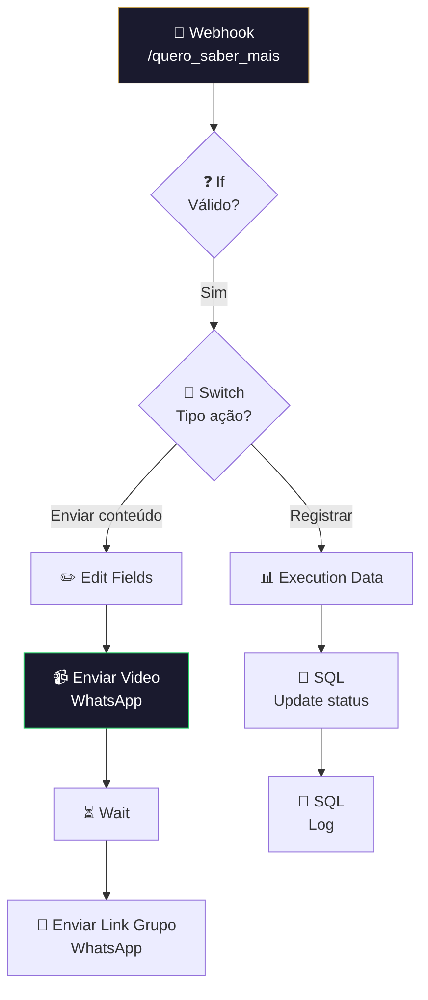

# ✅ 001.007 [3/3] — Envio de Convite: Resposta

!!! info "Visão Geral"
    Último estágio que processa respostas dos leads ao convite. Recebe webhook "Quero Saber Mais", valida, envia vídeo de apresentação + link do grupo WhatsApp, e registra conversão no banco.

## Ficha Técnica

| Campo | Valor |
|:------|:------|
| **ID** | `Q8fXdJi9qhdmrs3l` |
| **Status** | 🟢 Ativo |
| **Nós** | 20 |
| **Trigger** | Webhook POST `/quero_saber_mais` |
| **Tags** | `OK`, `Cadastrado`, `Documentado` |

---

## Fluxo

## Credenciais

| Serviço | Credencial |
|:--------|:-----------|
| PostgreSQL | `Evento Vendas` |