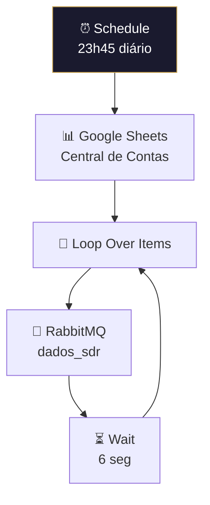

# 📊 001.015 — Dashboard: Evento Planilha Atualizada

!!! info "Visão Geral"
    Workflow agendado (23h45 diário) que lê a planilha "Central de Contas" no Google Sheets e publica cada linha na fila `dados_sdr` para sincronização com o banco. Funciona como dispatcher do pipeline de atualização de dados de clientes.

## Ficha Técnica

| Campo | Valor |
|:------|:------|
| **ID** | `cQ49sJd4FLFY5Jfz` |
| **Status** | 🟢 Ativo |
| **Nós** | 6 |
| **Trigger** | Schedule (23h45 diário) |

---

## Fluxo

### Planilha
**ID:** `1gKfaabHWubEUWkUGfqw7UwdCW4e2sKWOO80Y0ysfu6U` — aba "Central de Contas"

## Fila

| Fila | Consumer |
|:-----|:---------|
| `dados_sdr` | 001.014 — Atualizar Dados Cliente |

## Credenciais

| Serviço | Credencial |
|:--------|:-----------|
| Google Sheets | `ferramentas@harmoniza.pro` |
| RabbitMQ | `RabbitMQ` |