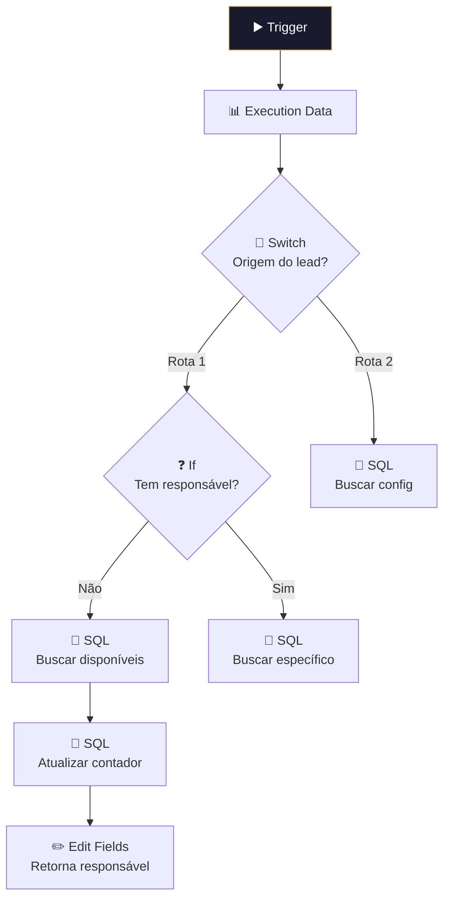

# 🎯 001.003 — Distribuição de Leads (Pipedrive)

!!! info "Visão Geral"
    Sub-workflow de distribuição round-robin de leads entre SDRs. Consulta o banco para identificar o próximo responsável disponível, atualiza contadores e retorna o email do SDR designado. Chamado por vários workflows (Calendly, Transferência, Leads Parados).

## Ficha Técnica

| Campo | Valor |
|:------|:------|
| **ID** | `gTkwd0N0FUTUzo9q` |
| **Status** | 🔴 Inativo (sub-workflow) |
| **Nós** | 18 |
| **Trigger** | Execute Workflow Trigger (passthrough) |
| **Tags** | `Cadastrado`, `Documentado` |

---

## Arquitetura

## Chamado por

| Workflow | Contexto |
|:---------|:---------|
| 001.002 — Calendly | Novo agendamento |
| 001.005 — Transferência | Lead transferido |
| 001.017 — Leads Parados | Redistribuição diária |

## Credenciais

| Serviço | Credencial |
|:--------|:-----------|
| PostgreSQL | `Postgres - Metricas` |