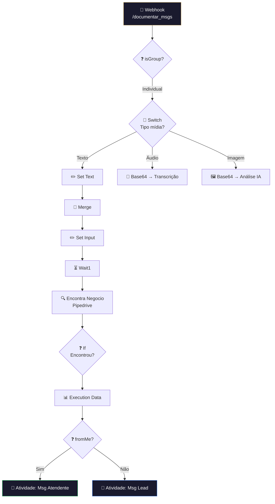

# 📝 001.009 — Pipedrive: Documentar Mensagens no CRM

!!! info "Visão Geral"
    Webhook que recebe mensagens do WhatsApp e as documenta como atividades no Pipedrive. Diferencia mensagens do lead e do atendente, processa texto, áudio, imagem, vídeo e documentos. Busca o deal correspondente por telefone.

## Ficha Técnica

| Campo | Valor |
|:------|:------|
| **ID** | `CJfeejjEkXAZwNeB` |
| **Status** | 🟢 Ativo |
| **Nós** | 34 (vários de mídia desabilitados) |
| **Trigger** | Webhook POST `/documentar_msgs` |

---

## Arquitetura

## Tipos de mídia (maioria desabilitada, apenas texto ativo)

| Tipo | Status | Processamento |
|:-----|:-------|:-------------|
| Texto | ✅ Ativo | Direto |
| Áudio | ❌ Desabilitado | Base64 → OpenAI Whisper |
| Imagem | ❌ Desabilitado | Base64 → OpenAI Vision |
| Vídeo | ❌ Desabilitado | Base64 → Google Gemini |
| Documento | ❌ Desabilitado | Base64 → Google Gemini |

## Credenciais

| Serviço | Credencial |
|:--------|:-----------|
| Pipedrive | `Pipedrive - evoluamidia@gmail.com` |