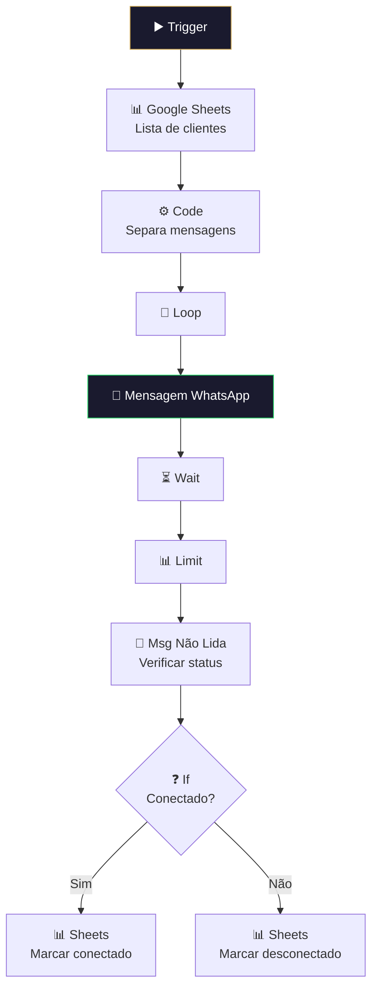

# 💬 001.008 — Envio de Mensagem: Clientes

!!! info "Visão Geral"
    Sub-workflow de envio de mensagens em massa para clientes via WhatsApp. Lê lista de destinatários do Google Sheets, verifica status de conexão do WhatsApp, e envia mensagens em lote com controle de rate limiting.

## Ficha Técnica

| Campo | Valor |
|:------|:------|
| **ID** | `VjXrQZZPivqrbNZM` |
| **Status** | 🔴 Inativo (sub-workflow) |
| **Nós** | 21 |
| **Trigger** | Execute Workflow Trigger (passthrough) |

---

## Fluxo

## Credenciais

| Serviço | Credencial |
|:--------|:-----------|
| Google Sheets | `ferramentas@harmoniza.pro` |