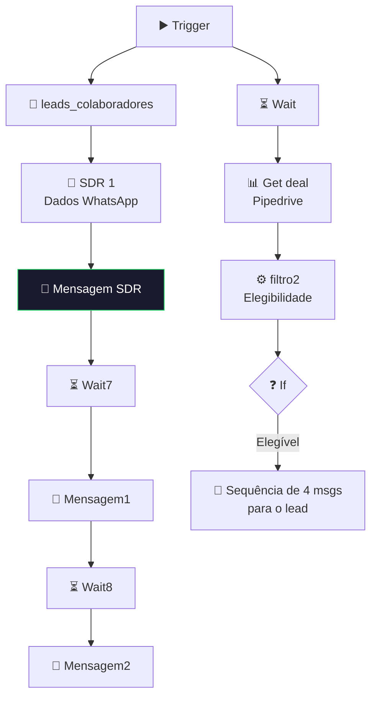

# 📱 001.004 — Typeform: Envio de Mensagem Parcial

!!! info "Visão Geral"
    Sub-workflow que envia mensagens WhatsApp para leads que preencheram parcialmente o formulário Typeform. Busca dados do deal no Pipedrive, filtra leads elegíveis e dispara sequência de mensagens para o SDR e para o lead.

## Ficha Técnica

| Campo | Valor |
|:------|:------|
| **ID** | `iW5VeKzMhlHTiLTF` |
| **Status** | 🔴 Inativo (sub-workflow) |
| **Nós** | 23 |
| **Trigger** | Execute Workflow Trigger (passthrough) |
| **Tags** | `Cadastrado`, `Documentado` |

---

## Fluxo

## Credenciais

| Serviço | Credencial |
|:--------|:-----------|
| Pipedrive | `Pipedrive - evoluamidia@gmail.com` |
| WhatsApp | `Z Api` |
| PostgreSQL | `Postgres - Metricas` |