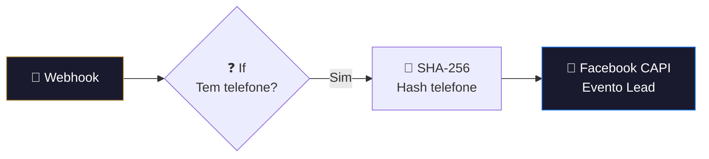

# 🎯 001.013 — Typeform: Evento Lead Clientes (Pixel)

!!! info "Visão Geral"
    Webhook leve que recebe dados de leads de clientes via pixel Typeform e dispara evento de conversão "Lead" para o Facebook Pixel via CAPI. Recebe pixel_id, token e telefone via query params.

## Ficha Técnica

| Campo | Valor |
|:------|:------|
| **ID** | `SiBXX9WD2onuqIAR` |
| **Status** | 🟢 Ativo |
| **Nós** | 4 |
| **Trigger** | Webhook (UUID path) |

---

## Fluxo

### Dados recebidos via Query Params
`pixel_id`, `token`, `telefone_usuario`, `_fbp`, `_fbc`, `user_agent`, `page_url`, `ip`

O mais simples da pasta — apenas 4 nós, sem banco, sem CRM.