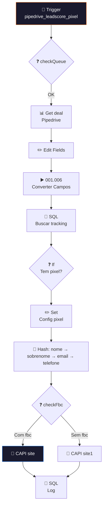

# 🎯 001.010 — Pipedrive: Evento Pixel Lead Score

!!! info "Visão Geral"
    Worker que consome eventos de lead scoring do Pipedrive e dispara conversões para o Facebook Pixel (CAPI). Busca dados do deal, converte campos customizados, consulta tracking no banco, e envia evento com dados hasheados.

## Ficha Técnica

| Campo | Valor |
|:------|:------|
| **ID** | `QEPP7Y3zLwbeOxta` |
| **Status** | 🟢 Ativo |
| **Nós** | 21 |
| **Trigger** | RabbitMQ — fila `pipedrive_leadscore_pixel` |
| **Tags** | `Cadastrado`, `Documentado` |

---

## Fluxo

## Credenciais

| Serviço | Credencial |
|:--------|:-----------|
| RabbitMQ | `RabbitMQ` |
| Pipedrive | `Pipedrive - evoluamidia@gmail.com` |
| PostgreSQL | `Postgres - Metricas` |