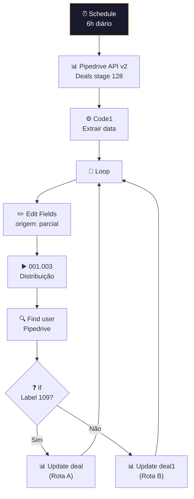

# ⏸️ 001.017 — Pipedrive: Leads Parados

!!! info "Visão Geral"
    Workflow diário (6h) que identifica leads parados no estágio 128 (pipeline 21) do Pipedrive, redistribui entre SDRs via sub-workflow de distribuição e move para o estágio 81 com novo responsável.

## Ficha Técnica

| Campo | Valor |
|:------|:------|
| **ID** | `hUgd3JCAuUFUh5e4` |
| **Status** | 🟢 Ativo |
| **Nós** | 10 |
| **Trigger** | Schedule (cron `0 6 * * *`) |

---

## Fluxo

### Regra de negócio
- Busca deals **abertos** no **stage 128** (pipeline 21) ordenados desc
- Redistribui via round-robin (001.003)
- Move todos para **stage 81** com novo responsável
- Label 109 diferencia rota de update

## Credenciais

| Serviço | Credencial |
|:--------|:-----------|
| Pipedrive | `Pipedrive - evoluamidia@gmail.com` |