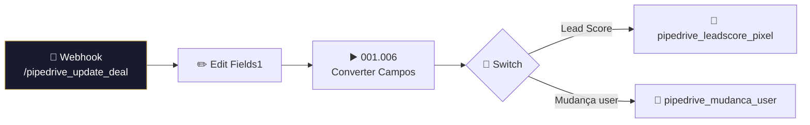

# 📊 001.011 — Pipedrive: Update Deal (Dispatcher)

!!! info "Visão Geral"
    Dispatcher que recebe webhooks de atualização de deals do Pipedrive, converte campos customizados e roteia para filas específicas: Lead Score Pixel (tracking) ou Mudança de Responsável.

## Ficha Técnica

| Campo | Valor |
|:------|:------|
| **ID** | `xawOX8VHRfM8AbwM` |
| **Status** | 🟢 Ativo |
| **Nós** | 10 |
| **Trigger** | Webhook POST `/pipedrive_update_deal` |
| **Tags** | `OK`, `Cadastrado`, `Documentado` |

---

## Fluxo

## Filas

| Fila | Consumer |
|:-----|:---------|
| `pipedrive_leadscore_pixel` | 001.010 |
| `pipedrive_mudanca_user` | (worker separado) |

## Credenciais

| Serviço | Credencial |
|:--------|:-----------|
| RabbitMQ | `RabbitMQ` |