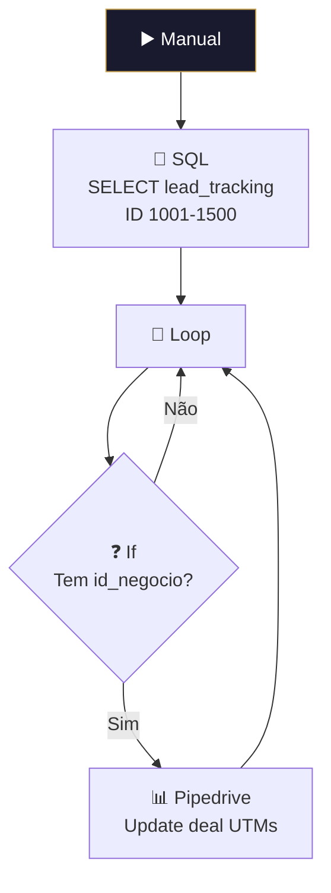

# 🔄 001.016 — Retroativo: Atualizar Campos UTM

!!! info "Visão Geral"
    Workflow manual de migração que lê dados UTM do PostgreSQL (tabela `lead_tracking`) e atualiza os campos customizados correspondentes nos deals do Pipedrive. Processa em lotes com range de IDs configurável.

## Ficha Técnica

| Campo | Valor |
|:------|:------|
| **ID** | `a5zLplTyFmXN5lgP` |
| **Status** | 🔴 Inativo (manual/retroativo) |
| **Nós** | 5 |
| **Trigger** | Manual |

---

## Fluxo

### Campos UTM mapeados

| Campo | Pipedrive Custom Field ID |
|:------|:--------------------------|
| utm_source | `98c23f53854a205bb9e1b9f1d17a5459e0dc7d16` |
| utm_medium | `e5ae032d7fda4523edaf73cae9dbff166e1861fe` |
| utm_campaign | `1154d85b97ab799ecb95476c040eef165f8eca98` |
| utm_term | `c83c89258b135c08b44d80a76eb69cf56fe41f99` |
| utm_id | `a3a4cd5a4cdeff61454f4b72aa0796d0fcb62cb7` |
| utm_content | `f411adfb5c1ccd6968627615551f614fe248c254` |

## Credenciais

| Serviço | Credencial |
|:--------|:-----------|
| PostgreSQL | `Postgres - Metricas` |
| Pipedrive | `Pipedrive - evoluamidia@gmail.com` |