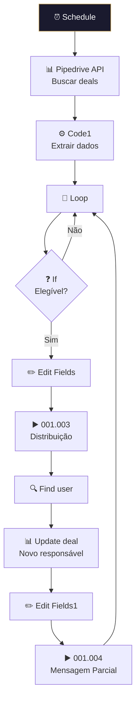

# 🔄 001.005 — Pipedrive: Transferência de Leads

!!! info "Visão Geral"
    Workflow agendado que busca deals em estágio específico do Pipedrive, redistribui entre SDRs via sub-workflow de distribuição, atualiza o responsável e dispara envio de mensagem parcial.

## Ficha Técnica

| Campo | Valor |
|:------|:------|
| **ID** | `KTWEvow3Z8rGab9H` |
| **Status** | 🟢 Ativo |
| **Nós** | 17 |
| **Trigger** | Schedule Trigger |
| **Tags** | `Cadastrado`, `Documentado` |

---

## Fluxo

## Sub-workflows chamados

| Sub-workflow | Função |
|:-------------|:-------|
| 001.003 — Distribuição | Round-robin de SDRs |
| 001.004 — Mensagem Parcial | Envio WhatsApp |

## Credenciais

| Serviço | Credencial |
|:--------|:-----------|
| Pipedrive | `Pipedrive - evoluamidia@gmail.com` |