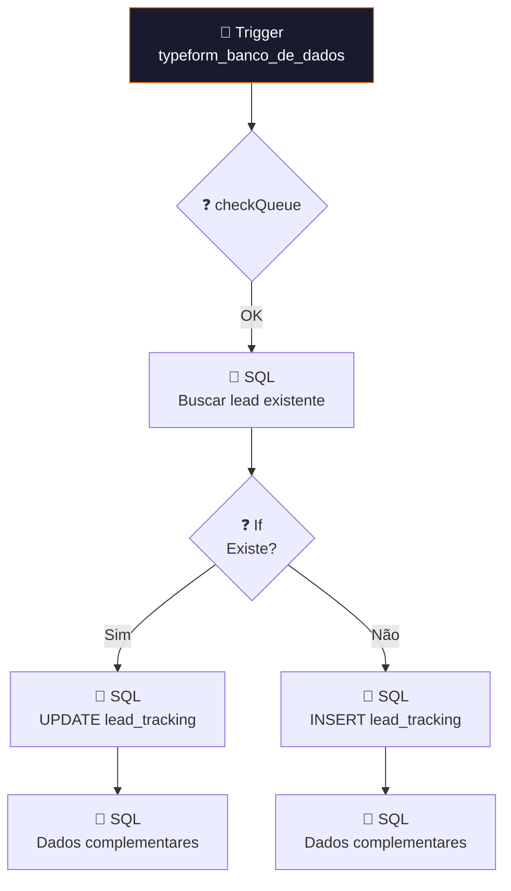

# 🗄️ 001.012 — Typeform: Banco de Dados

!!! info "Visão Geral"
    Worker que consome dados de formulários Typeform da fila e persiste no PostgreSQL. Verifica se o lead já existe no banco (INSERT ou UPDATE) e executa queries de tracking.

## Ficha Técnica

| Campo | Valor |
|:------|:------|
| **ID** | `nZU47kosH8E2FkJ5` |
| **Status** | 🟢 Ativo |
| **Nós** | 13 |
| **Trigger** | RabbitMQ — fila `typeform_banco_de_dados` |
| **Tags** | `OK`, `Cadastrado`, `Documentado` |

---

## Fluxo

## Fila

| Fila | Publisher |
|:-----|:---------|
| `typeform_banco_de_dados` | 001.001 [1/2] e [2/2] |

## Credenciais

| Serviço | Credencial |
|:--------|:-----------|
| RabbitMQ | `RabbitMQ` |
| PostgreSQL | `Postgres - Metricas` |