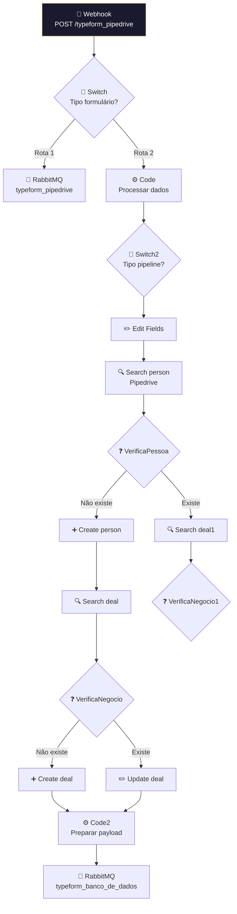

# 📋 001.001 [1/2] — Typeform: Formulários (Webhook)

!!! info "Visão Geral"
    Receptor principal de formulários Typeform. Recebe envios via webhook, processa os dados, cria/atualiza pessoas e deals no Pipedrive, e publica na fila para persistência no banco de dados. Também envia para tracking pixel.

## Ficha Técnica

| Campo | Valor |
|:------|:------|
| **ID** | `0hGkd1W7Aqg8qUUH` |
| **Status** | 🟢 Ativo |
| **Nós** | 30 |
| **Trigger** | Webhook POST `/typeform_pipedrive` |
| **Error Workflow** | `ByxX1TqYfyvlgp2T` |
| **Tags** | `OK`, `Cadastrado`, `Documentado` |

---

## Arquitetura

---

## Fluxo Principal

1. **Webhook** recebe POST do Typeform
2. **Switch** identifica tipo de formulário e roteia
3. **Code** processa e normaliza dados do Typeform
4. **Switch2** identifica pipeline (pré-vendas vs vendas)
5. **Pipedrive**: Search person → Create/Update person → Search deal → Create/Update deal
6. **Code2** monta payload → publica na fila `typeform_banco_de_dados`

## Filas RabbitMQ

| Fila | Direção | Consumer |
|:-----|:--------|:---------|
| `typeform_pipedrive` | Publica → | 001.001 [2/2] |
| `typeform_banco_de_dados` | Publica → | 001.012 |

## Credenciais

| Serviço | Credencial |
|:--------|:-----------|
| RabbitMQ | `RabbitMQ` |
| Pipedrive | `Pipedrive - evoluamidia@gmail.com` |