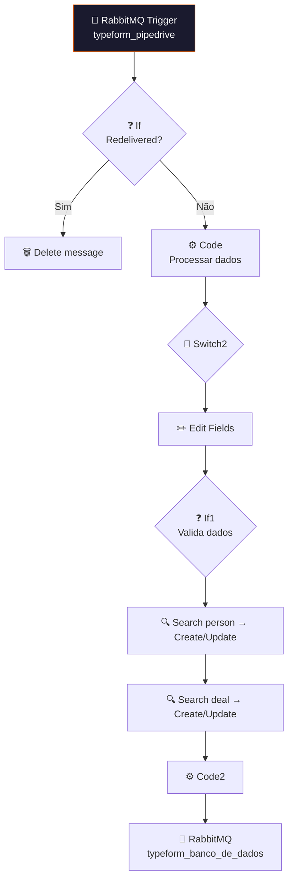

# 📋 001.001 [2/2] — Typeform: Formulários (Worker)

!!! info "Visão Geral"
    Worker que consome da fila `typeform_pipedrive` e executa a mesma lógica de criação/atualização no Pipedrive. Garante processamento assíncrono e resiliente quando o webhook direto falha ou precisa reprocessar.

## Ficha Técnica

| Campo | Valor |
|:------|:------|
| **ID** | `ut7SuyAS0AQ3bywe` |
| **Status** | 🟢 Ativo |
| **Nós** | 30 |
| **Trigger** | RabbitMQ — fila `typeform_pipedrive` |
| **Error Workflow** | `ByxX1TqYfyvlgp2T` |
| **Tags** | `OK`, `Cadastrado`, `Documentado` |

---

## Arquitetura

## Fluxo

Idêntico ao [1/2], mas consome da fila RabbitMQ em vez de webhook. Inclui dedup por `redelivered`.

## Filas

| Fila | Direção | Contraparte |
|:-----|:--------|:------------|
| `typeform_pipedrive` | ← Consome | [1/2] publica |
| `typeform_banco_de_dados` | Publica → | 001.012 consome |

## Credenciais

| Serviço | Credencial |
|:--------|:-----------|
| RabbitMQ | `RabbitMQ` |
| Pipedrive | `Pipedrive - evoluamidia@gmail.com` |