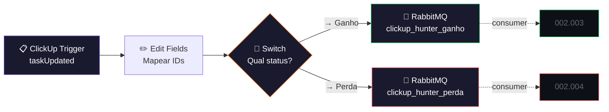

# 🎛️ 002.000 — Hunters: Central de Automação

!!! info "Visão Geral"
    Dispatcher que escuta atualizações no CRM de Hunters (ClickUp) e roteia eventos para filas RabbitMQ. Quando um Hunter move uma task para "ganho" ou "perdido", organiza os IDs dos campos customizados e publica na fila correspondente para validação assíncrona.

## Ficha Técnica

| Campo | Valor |
|:------|:------|
| **Nome** | 002.000 - Hunters - Central de Automação |
| **ID** | `TIfgM9x1GvzTTwFH` |
| **Instância** | `workflows.goldeletra.pro` |
| **Status** | 🟢 Ativo |
| **Nós** | 7 |
| **Trigger** | ClickUp Trigger — `taskUpdated` |
| **Dependências** | ClickUp, RabbitMQ |

---

## Arquitetura

---

## Nós em Detalhe

### 1. ClickUp Trigger
**Tipo:** `clickUpTrigger` v1

| Parâmetro | Valor |
|:----------|:------|
| **Evento** | `taskUpdated` |
| **Credencial** | `ClickUp - Ferramentas` |

### 2. Edit Fields
**Tipo:** `set` v3.4

Mapeia os IDs dos campos customizados do CRM Hunter em variáveis legíveis, montando o payload que será publicado nas filas:

| Variável | ID do Campo | Tipo |
|:---------|:------------|:-----|
| `Campo Automações` | `79a04869-f666-42c7-8f93-2cf7a313d22d` | Label de status |
| `Campo Ganho` | `310977e6-9d21-48d6-ba20-37258a360246` | Dropdown |
| `Campo Perda` | `b56ff4d6-eb48-42f5-b113-8384e5c2e3a0` | Dropdown |
| `Campo Ganho Aprovado` | `90a90c44-5bdb-414d-a3d5-fae43c5cfe46` | Valor de opção |
| `Campo Ganho Recusado` | `98ea8f40-0989-4fc8-9aab-2122f0e59d91` | Valor de opção |
| `Campo Perda Aprovada` | `9538ca8f-c96b-40c7-8d35-2c75afff27fc` | Valor de opção |
| `Campo Perda Recusada` | `efaced45-d55f-454e-bcab-04ede697075a` | Valor de opção |
| `Campo Motivo Perda` | `21511f56-6349-45bd-af6b-7fc2883c575f` | Campo obrigatório |

### 3. Switch
**Tipo:** `switch` v3.4

| Condição | Saída | Fila |
|:---------|:------|:-----|
| Status → Ganho | `Ganho` | `clickup_hunter_ganho` |
| Status → Perda | `Perda` | `clickup_hunter_perda` |

### 4–5. RabbitMQ Publish
Ambas as filas são **quorum queues** duráveis — garantem entrega mesmo se o RabbitMQ reiniciar.

---

## Credenciais

| Serviço | Credencial |
|:--------|:-----------|
| ClickUp | `ClickUp - Ferramentas` |
| RabbitMQ | `RabbitMQ` |

---

## Troubleshooting

| Problema | Causa | Solução |
|:---------|:------|:--------|
| Trigger não dispara | Webhook desregistrado no ClickUp | Desativar e reativar o workflow |
| Fila não recebe | RabbitMQ offline | Verificar serviço |
| Switch não roteia | Condição de status alterada | Atualizar condições no nó Switch |