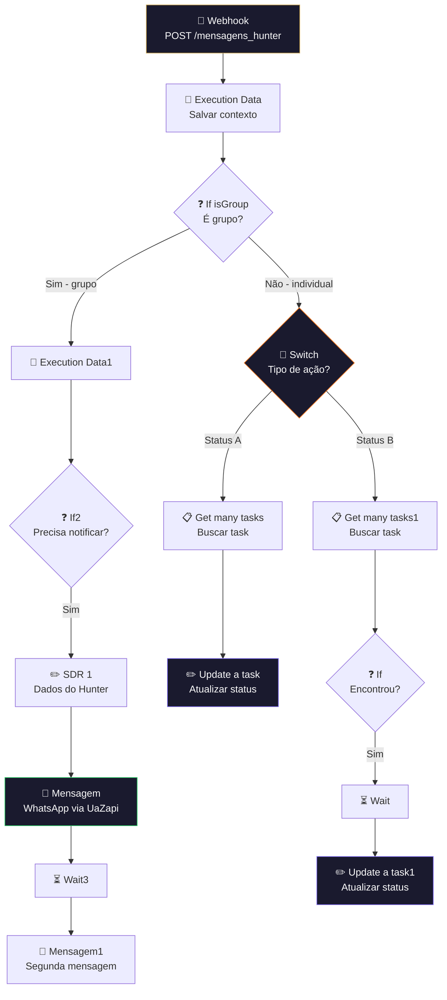

# 💬 002.002 — ClickUp: CRM Hunter

!!! info "Visão Geral"
    Recebe mensagens de interação com leads via webhook, identifica se é grupo ou individual, atualiza o status da task no CRM dos Hunters e envia notificações via WhatsApp (UaZapi) para o SDR responsável. Gerencia o fluxo de comunicação entre leads e Hunters.

## Ficha Técnica

| Campo | Valor |
|:------|:------|
| **Nome** | 002.002 - Clickup - CRM Hunter |
| **ID** | `PdKhXuFuVERax1A6` |
| **Instância** | `workflows.goldeletra.pro` |
| **Status** | 🟢 Ativo |
| **Nós** | 19 |
| **Trigger** | Webhook POST `/mensagens_hunter` |
| **Dependências** | ClickUp, UaZapi (WhatsApp) |

---

## Arquitetura

---

## Fluxo Detalhado

### 1. Recebimento e validação
O webhook `/mensagens_hunter` recebe notificações de mensagens. O **Execution Data** salva o contexto para rastreabilidade.

### 2. Filtro de grupo
**If isGroup** verifica se a mensagem veio de um grupo WhatsApp:

- **Grupo** → segue para notificação do SDR
- **Individual** → segue para atualização do CRM

### 3. Rota individual (Switch)
O **Switch** decide a ação baseado no tipo de interação:

| Rota | Ação |
|:-----|:-----|
| Rota A | Busca task + **Update a task** (atualização imediata) |
| Rota B | Busca task + **If** (verifica existência) + **Wait** + **Update a task1** (atualização com delay) |

O **Wait** entre busca e atualização serve para evitar conflitos de escrita no ClickUp quando múltiplas mensagens chegam em sequência.

### 4. Notificação do Hunter
Quando necessário, envia mensagens via WhatsApp:

- **SDR 1** — configura dados do Hunter (host do UaZapi, número)
- **Mensagem** — primeira mensagem via `{host}/send/text`
- **Wait3** — delay entre mensagens
- **Mensagem1** — segunda mensagem (detalhes adicionais)

### 5. Rastreabilidade
Quatro nós **Execution Data** salvam estado em diferentes pontos do fluxo para auditoria.

---

## Credenciais

| Serviço | Credencial | Uso |
|:--------|:-----------|:----|
| ClickUp | `ClickUp - Ferramentas` | CRUD de tasks |
| *(UaZapi)* | Via nó SDR 1 (dinâmico) | Envio WhatsApp |

---

## Troubleshooting

| Problema | Causa | Solução |
|:---------|:------|:--------|
| Mensagem não chega no Hunter | Host UaZapi errado no SDR 1 | Verificar campo `host` |
| Task não atualiza | Task não encontrada na busca | Verificar filtros no Get many tasks |
| Duplicidade de notificação | Webhook chamado 2x | Verificar dedup no caller |
| Timeout no Wait | Delay muito longo | Ajustar tempo no nó Wait |