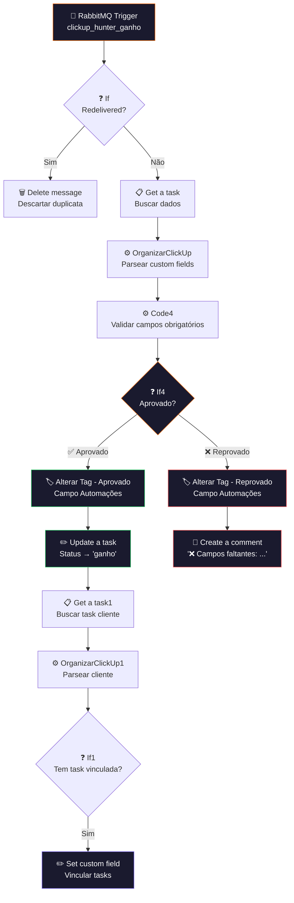

# ✅ 002.003 — Hunters: Ganho

!!! info "Visão Geral"
    Worker que consome a fila `clickup_hunter_ganho`, valida se todos os campos obrigatórios estão preenchidos e aprova ou rejeita o ganho. Se aprovado, atualiza o status da task para "ganho" e vincula com a task do cliente. Se reprovado, marca como recusado e adiciona um comentário indicando os campos faltantes.

## Ficha Técnica

| Campo | Valor |
|:------|:------|
| **Nome** | 002.003 - Hunters - Ganho |
| **ID** | `9LCzkcuPhBYaK1MO` |
| **Instância** | `workflows.goldeletra.pro` |
| **Status** | 🟢 Ativo |
| **Nós** | 15 |
| **Trigger** | RabbitMQ — fila `clickup_hunter_ganho` |
| **Dependências** | RabbitMQ, ClickUp |

---

## Arquitetura



---

## Fluxo Detalhado

### 1. Consumo e dedup
- **RabbitMQ Trigger** consome da fila `clickup_hunter_ganho` (quorum, acknowledge on success)
- **If** verifica `redelivered` — se a mensagem já foi entregue antes, descarta para evitar reprocessamento

### 2. Busca e organização
- **Get a task** busca dados completos da task pelo `task_id` recebido
- **OrganizarClickUp** parseia todos os custom fields em JSON estruturado (code JavaScript padrão)

### 3. Validação de campos obrigatórios
**Code4** verifica se todos os campos obrigatórios para um ganho estão preenchidos. Campos validados incluem informações do cliente, valor do contrato, etc.

Se algum campo obrigatório estiver vazio:

```
❌ Reprovado!

📋 Necessário preencher os seguintes campos:

🔸 Campo X
🔸 Campo Y
```

### 4. Aprovação

| Resultado | Ações |
|:----------|:------|
| **Aprovado** | Tag → `Campo Ganho Aprovado` → Status → `ganho` → Busca task cliente → Vincula |
| **Reprovado** | Tag → `Campo Ganho Recusado` → Comentário com campos faltantes |

### 5. Vinculação (apenas aprovado)
Após marcar como ganho, busca a task do cliente na Gestão de Clientes e vincula via custom field de relação — garantindo rastreabilidade bidirecional.

---

## Diferença do 002.004 (Perda)

| Aspecto | 002.003 (Ganho) | 002.004 (Perda) |
|:--------|:----------------|:-----------------|
| **Fila** | `clickup_hunter_ganho` | `clickup_hunter_perda` |
| **Status final** | `ganho` | `perdido` |
| **Campo validado** | Campos de contrato | `Motivo da Perda` |
| **Pós-aprovação** | Vincula com task cliente | Apenas atualiza status |
| **Nós** | 15 | 11 |

---

## Credenciais

| Serviço | Credencial |
|:--------|:-----------|
| RabbitMQ | `RabbitMQ` |
| ClickUp | `ClickUp - Ferramentas` |

---

## Troubleshooting

| Problema | Causa | Solução |
|:---------|:------|:--------|
| Mensagem reprocessada | RabbitMQ reentregou | Normal — nó If descarta redelivered |
| Sempre reprovado | Campo obrigatório vazio no ClickUp | Hunter deve preencher antes de mover |
| Vinculação falha | Task cliente não encontrada | Verificar se 002.001 criou a task |
| Tag não atualiza | ID do campo mudou | Verificar IDs no payload da 002.000 |