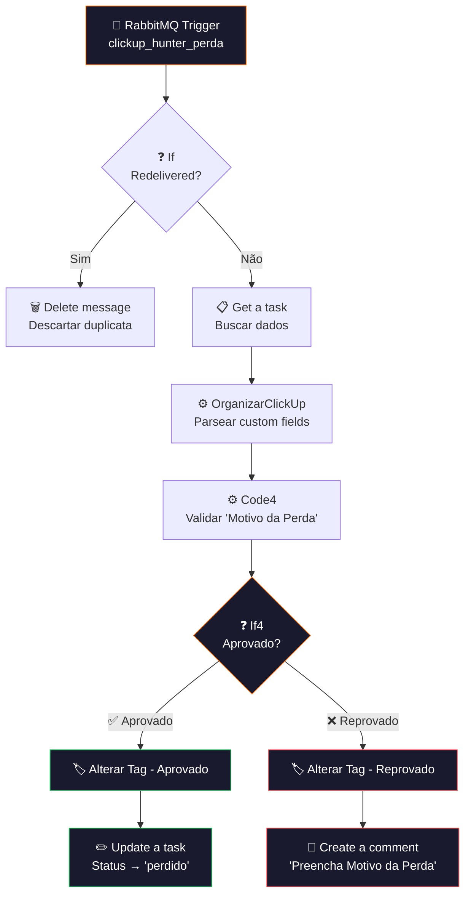

# ❌ 002.004 — Hunters: Perda

!!! info "Visão Geral"
    Worker que consome a fila `clickup_hunter_perda`, valida se o campo "Motivo da Perda" está preenchido e aprova ou rejeita a perda. Se aprovado, atualiza o status da task para "perdido". Se reprovado, marca como recusado e adiciona comentário indicando o campo faltante.

## Ficha Técnica

| Campo | Valor |
|:------|:------|
| **Nome** | 002.004 - Hunters - Perda |
| **ID** | `3JKcrR9LtP31Lh0r` |
| **Instância** | `workflows.goldeletra.pro` |
| **Status** | 🟢 Ativo |
| **Nós** | 11 |
| **Trigger** | RabbitMQ — fila `clickup_hunter_perda` |
| **Dependências** | RabbitMQ, ClickUp |

---

## Arquitetura



---

## Fluxo Detalhado

### 1. Consumo e dedup
- **RabbitMQ Trigger** consome da fila `clickup_hunter_perda` (quorum, acknowledge on success, 1 mensagem por vez)
- **If** verifica `redelivered` — descarta duplicatas

### 2. Busca e organização
- **Get a task** busca a task completa pelo `task_id`
- **OrganizarClickUp** parseia custom fields (JavaScript padrão reutilizado em todos os workflows)

### 3. Validação
**Code4** verifica especificamente o campo **"Motivo da Perda"** (`21511f56-6349-45bd-af6b-7fc2883c575f`).

Se o campo estiver vazio, retorna:

```
❌ Reprovado!

📋 Necessário preencher os seguintes campos:

🔸 Motivo da Perda
```

### 4. Aprovação ou rejeição

| Resultado | Ações executadas |
|:----------|:----------------|
| **Aprovado** (motivo preenchido) | `Alterar Tag` → `Campo Perda Aprovada` → `Update a task` → status `perdido` |
| **Reprovado** (motivo vazio) | `Alterar Tag` → `Campo Perda Recusada` → `Create a comment` com campos faltantes |

### Custom fields envolvidos

| Campo | ID | Ação |
|:------|:---|:-----|
| Automações | `79a04869-f666-42c7-8f93-2cf7a313d22d` | Recebe tag de aprovado/reprovado |
| Perda Aprovada | `9538ca8f-c96b-40c7-8d35-2c75afff27fc` | Valor setado se aprovado |
| Perda Recusada | `efaced45-d55f-454e-bcab-04ede697075a` | Valor setado se reprovado |
| Motivo da Perda | `21511f56-6349-45bd-af6b-7fc2883c575f` | Campo obrigatório validado |

---

## Regra de Negócio

O Hunter **não pode** registrar uma perda sem justificar o motivo. Isso garante:

1. **Dados para análise** — entender por que leads são perdidos
2. **Accountability** — impedir que Hunters descartem leads sem critério
3. **Melhoria contínua** — identificar padrões de perda para otimizar o processo

Se o Hunter tenta marcar como "perdido" sem preencher, a automação rejeita e deixa um comentário na task explicando o que falta.

---

## Credenciais

| Serviço | Credencial |
|:--------|:-----------|
| RabbitMQ | `RabbitMQ` |
| ClickUp | `ClickUp - Ferramentas` |

---

## Troubleshooting

| Problema | Causa | Solução |
|:---------|:------|:--------|
| Sempre reprovado | "Motivo da Perda" vazio | Hunter precisa preencher o campo antes |
| Tag não muda | ID do campo Automações alterado | Verificar IDs no payload da 002.000 |
| Comentário não aparece | Permissão de escrita | Verificar credencial ClickUp |
| Status não muda | Task bloqueada por automação ClickUp | Verificar regras de automação nativas |