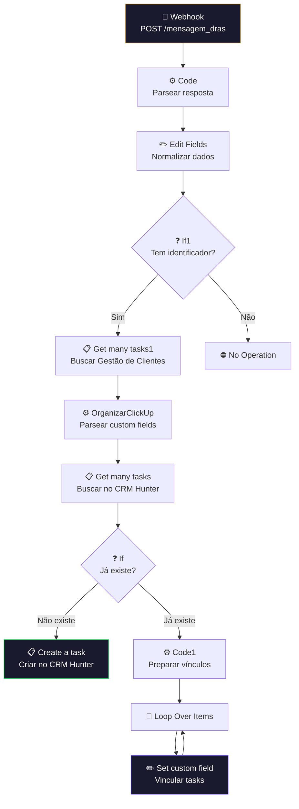

# 📋 002.001 — Typeform: Clientes

!!! info "Visão Geral"
    Recebe respostas do Typeform via webhook, verifica se o cliente já existe no CRM dos Hunters (ClickUp), cria a task se for novo e vincula com a task na lista de Gestão de Clientes. Faz a ponte entre o formulário de onboarding e o CRM.

## Ficha Técnica

| Campo | Valor |
|:------|:------|
| **Nome** | 002.001 - Typeform - Clientes |
| **ID** | `l7D22vQHSuxBcoYQ` |
| **Instância** | `workflows.goldeletra.pro` |
| **Status** | 🟢 Ativo |
| **Nós** | 14 (1 desabilitado) |
| **Trigger** | Webhook POST `/mensagem_dras` |
| **Dependências** | ClickUp |

---

## Arquitetura

---

## Fluxo Detalhado

### 1. Recebimento
O Typeform envia as respostas do formulário de onboarding para o endpoint `/mensagem_dras`.

### 2. Parseamento
Dois nós processam sequencialmente: **Code** extrai campos relevantes, **Edit Fields** normaliza para o formato ClickUp.

### 3. Verificação de duplicidade
- **If1** — checa se veio identificador no formulário
- **Get many tasks1** — busca na lista Gestão de Clientes pelo identificador
- **OrganizarClickUp** — parseia custom fields da task encontrada (code JavaScript reutilizável)

### 4. Busca no CRM Hunter
Com os dados do cliente, busca se já existe uma task no CRM dos Hunters.

### 5. Criação ou vinculação

| Cenário | Ação |
|:--------|:-----|
| Novo cliente | **Create a task** → cria task no CRM Hunter |
| Cliente existente | **Loop + Set custom field** → vincula tasks entre listas |

---

## Nó Desabilitado

**Call 'Envio de Mensagem - Clientes'** — sub-workflow para enviar mensagem de boas-vindas. Desabilitado atualmente. Quando reativado, executa antes da busca no CRM.

---

## Credenciais

| Serviço | Credencial |
|:--------|:-----------|
| ClickUp | `ClickUp - Ferramentas` |

---

## Troubleshooting

| Problema | Causa | Solução |
|:---------|:------|:--------|
| Webhook não recebe | URL não configurada no Typeform | Verificar webhook URL no Typeform |
| Task duplicada | Filtro de busca não encontrou existente | Checar campo de identificador |
| Vínculo não criado | ID do campo relação mudou | Atualizar no nó Set custom field |