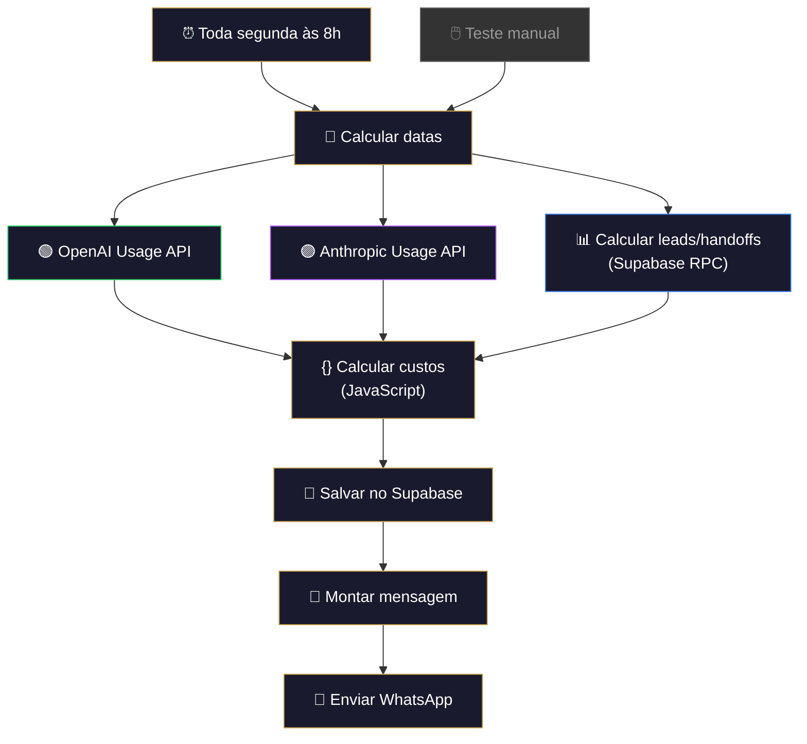
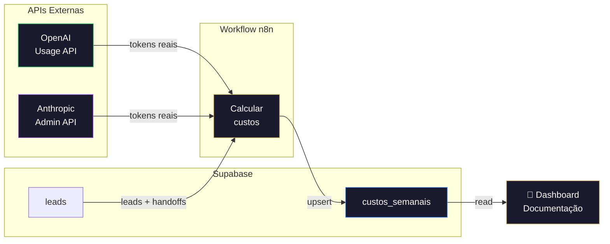

# 💰 Monitoramento de Custos Semanal

!!! info "Visão Geral"
    Workflow que roda toda segunda-feira às 8h, consulta as APIs de usage da Anthropic e OpenAI, calcula os custos da semana anterior, salva no Supabase e envia um relatório detalhado via WhatsApp com breakdown por API e alerta se o custo ultrapassar o threshold.

## Ficha Técnica

| Campo | Valor |
|:------|:------|
| **Nome** | Monitoramento de Custos Semanal |
| **Instância** | `workflows.goldeletra.pro` |
| **Status** | 🟢 Ativo |
| **Nós** | 9 |
| **Trigger** | Schedule — `0 8 * * 1` (toda segunda às 8h) |
| **Execução média** | ~5 segundos |
| **Dependências** | Supabase, OpenAI Usage API, Anthropic Admin API, UaZapi |

---

## Arquitetura



O fluxo executa 3 consultas em **paralelo** (OpenAI, Anthropic, Supabase) e depois converge no nó de cálculo.

---

## Nós em Detalhe

### 1. Toda segunda às 8h
**Tipo:** `scheduleTrigger` v1.2

Cron expression: `0 8 * * 1` — dispara toda segunda-feira às 08:00.

Escolhido segunda de manhã para que o relatório cubra a semana de trabalho completa (segunda a domingo anterior).

---

### 2. Calcular datas
**Tipo:** `set` v3.4

Calcula dinamicamente o período da semana anterior e os timestamps Unix necessários para as APIs.

| Campo | Expressão | Exemplo |
|:------|:----------|:--------|
| `periodo_inicio` | `$now.minus({days: 7}).toFormat('yyyy-MM-dd')` | `2026-02-16` |
| `periodo_fim` | `$now.minus({days: 1}).toFormat('yyyy-MM-dd')` | `2026-02-22` |
| `start_timestamp` | `Math.floor($now.minus({days: 7}).toMillis() / 1000)` | `1771265609` |
| `end_timestamp` | `Math.floor($now.minus({days: 1}).toMillis() / 1000)` | `1771784009` |

Os timestamps são usados pela OpenAI Usage API (formato Unix). As datas ISO são usadas pela Anthropic e Supabase.

---

### 3. OpenAI Usage API
**Tipo:** `httpRequest` v4.2 — `continueOnFail: true`

Consulta a API de usage da OpenAI para obter tokens consumidos por modelo.

| Parâmetro | Valor |
|:----------|:------|
| **Method** | `GET` |
| **URL** | `https://api.openai.com/v1/organization/usage/completions?start_time={start_timestamp}&end_time={end_timestamp}&bucket_width=1d&group_by=model` |

**Headers:**

| Header | Valor |
|:-------|:------|
| `Authorization` | `Bearer {OPENAI_ADMIN_KEY}` |

**Retorno esperado:**

```json
{
  "data": [
    {
      "results": [
        {
          "model": "gpt-4o-mini-2024-07-18",
          "input_tokens": 6947,
          "output_tokens": 367,
          "num_model_requests": 3
        }
      ]
    }
  ]
}
```

!!! warning "Permissão necessária"
    A API key precisa do scope `api.usage.read`. Apenas chaves com role **Admin** possuem essa permissão. Se falhar com 403, o nó de cálculo usa estimativas.

---

### 4. Anthropic Usage API
**Tipo:** `httpRequest` v4.2 — `continueOnFail: true`

Consulta a Admin API da Anthropic para obter usage por modelo.

| Parâmetro | Valor |
|:----------|:------|
| **Method** | `GET` |
| **URL** | `https://api.anthropic.com/v1/organizations/usage_report/messages?starting_at={iso_start}&ending_at={iso_end}&bucket_width=1d&group_by[]=model` |

**Headers:**

| Header | Valor |
|:-------|:------|
| `x-api-key` | Admin API key (`sk-ant-admin01-...`) |
| `anthropic-version` | `2023-06-01` |

**Retorno esperado:**

Tokens de input/output por modelo (Claude Sonnet 4, Claude Sonnet 4.5, etc.) agrupados por dia.

!!! note "Admin Key"
    A Anthropic requer uma **Admin API Key** (diferente da API key normal). Criada em: console.anthropic.com → Settings → API Keys → Admin Keys.

---

### 5. Calcular leads/handoffs
**Tipo:** `httpRequest` v4.2

Chama a função RPC `calcular_custos_semana` no Supabase para obter volume de leads e handoffs no período.

| Parâmetro | Valor |
|:----------|:------|
| **Method** | `POST` |
| **URL** | `https://jauunacntwpztmzgpeft.supabase.co/rest/v1/rpc/calcular_custos_semana` |
| **Body** | `{ "p_inicio": "2026-02-16", "p_fim": "2026-02-22" }` |

**Headers:**

| Header | Valor |
|:-------|:------|
| `apikey` | Service role key |
| `Authorization` | `Bearer {service_role_key}` |
| `Content-Type` | `application/json` |

---

### 6. Calcular custos
**Tipo:** `code` v2 (JavaScript)

Nó central que processa os dados dos 3 nós anteriores e calcula todos os custos.

**Lógica de cálculo:**

```
Se OpenAI Usage API retornou dados reais:
  → Soma tokens de input/output por modelo
  → Aplica pricing real por modelo

Se API falhou (fallback):
  → Estima baseado no volume de leads
  → ~$0.03 por lead (média ponderada)

Anthropic:
  → Estima: leads × 5 interações × tokens médios
  → Input: 2.000 tokens/interação × $3/1M
  → Output: 500 tokens/interação × $15/1M

Google (Gemini):
  → Estima: leads × $0.002 (muito barato)
```

**Tabela de preços usada:**

| Modelo | Input/1M | Output/1M |
|:-------|:---------|:----------|
| Claude Sonnet 4 | $3.00 | $15.00 |
| Claude Sonnet 4.5 | $3.00 | $15.00 |
| GPT-5 | $2.00 | $8.00 |
| GPT-4o | $2.50 | $10.00 |
| GPT-4o Mini | $0.15 | $0.60 |
| Gemini Flash | $0.075 | $0.30 |

**Campos calculados:**

| Campo | Descrição |
|:------|:----------|
| `custo_total_usd` | Soma de todos os custos de API |
| `custo_total_brl` | USD × cotação (R$ 5,80) |
| `custo_por_lead` | Total BRL ÷ leads no período |
| `custo_por_handoff` | Total BRL ÷ handoffs no período |
| `acima_do_threshold` | `true` se custo > $50/semana |

**Threshold de alerta:** $50 USD/semana (~R$ 290). Configurável na variável `threshold` dentro do código.

---

### 7. Salvar no Supabase
**Tipo:** `httpRequest` v4.2

Salva o resultado na tabela `custos_semanais` via REST API com `UPSERT`.

| Parâmetro | Valor |
|:----------|:------|
| **Method** | `POST` |
| **URL** | `https://jauunacntwpztmzgpeft.supabase.co/rest/v1/custos_semanais?on_conflict=periodo_inicio,periodo_fim` |

**Headers adicionais:**

| Header | Valor |
|:-------|:------|
| `Prefer` | `return=minimal,resolution=merge-duplicates` |

O `on_conflict` garante que re-execuções atualizam o registro existente em vez de criar duplicatas.

---

### 8. Montar mensagem
**Tipo:** `set` v3.4

Monta o relatório formatado para WhatsApp:

```
💰 *RELATÓRIO DE CUSTOS SEMANAL*
2026-02-16 → 2026-02-22
━━━━━━━━━━━━━━━━━━━━━━━

📊 *Volume:*
   📥 Leads: 47
   🤝 Handoffs: 19

🤖 *Custos por API:*
   🟣 Anthropic: $1.2750
   🟢 OpenAI: $0.8430
   🔵 Google: $0.0940

💵 *Total:*
   USD: $2.21
   BRL: R$ 12.82

📈 *Custo unitário:*
   Por lead: R$ 0.27
   Por handoff: R$ 0.67

✅ Custos dentro do esperado
```

Se o custo ultrapassar o threshold, a última linha muda para:

```
🚨 *ALERTA: Custo acima do threshold de $50/semana!*
```

---

### 9. Enviar WhatsApp
**Tipo:** `httpRequest` v4.2

Envia via API do UaZapi (mesmo padrão do workflow de Métricas Diárias).

---

## Tabela: custos_semanais

```sql
CREATE TABLE custos_semanais (
  id                  UUID PRIMARY KEY DEFAULT gen_random_uuid(),
  periodo_inicio      DATE NOT NULL,
  periodo_fim         DATE NOT NULL,
  openai_tokens_input     BIGINT DEFAULT 0,
  openai_tokens_output    BIGINT DEFAULT 0,
  openai_custo_usd        NUMERIC(10,4) DEFAULT 0,
  openai_requests         INTEGER DEFAULT 0,
  anthropic_tokens_input  BIGINT DEFAULT 0,
  anthropic_tokens_output BIGINT DEFAULT 0,
  anthropic_custo_usd     NUMERIC(10,4) DEFAULT 0,
  anthropic_requests      INTEGER DEFAULT 0,
  google_custo_usd        NUMERIC(10,4) DEFAULT 0,
  custo_total_usd         NUMERIC(10,4) DEFAULT 0,
  custo_total_brl         NUMERIC(10,4) DEFAULT 0,
  cotacao_usd_brl         NUMERIC(6,2) DEFAULT 5.80,
  leads_no_periodo        INTEGER DEFAULT 0,
  handoffs_no_periodo     INTEGER DEFAULT 0,
  custo_por_lead          NUMERIC(10,4) DEFAULT 0,
  custo_por_handoff       NUMERIC(10,4) DEFAULT 0,
  acima_do_threshold      BOOLEAN DEFAULT false,
  threshold_usd           NUMERIC(10,2) DEFAULT 50.00,
  calculado_em            TIMESTAMPTZ DEFAULT NOW(),
  UNIQUE(periodo_inicio, periodo_fim)
);
```

**RLS:** Leitura pública habilitada para consumo pelo dashboard da documentação.

---

## Variáveis de Ambiente

| Variável | Descrição | Onde obter |
|:---------|:----------|:-----------|
| `SUPABASE_SECRET_KEY` | Service role key (escrita) | Supabase → Settings → API Keys → Secret key |
| `OPENAI_ADMIN_KEY` | Chave com scope admin | platform.openai.com → API Keys (role: Admin) |
| `ANTHROPIC_API_KEY` | Admin API key | console.anthropic.com → Admin Keys |
| `UAZAPI_URL` | URL do servidor UaZapi | Já configurado nos outros workflows |
| `UAZAPI_TOKEN` | Token da instância | Já configurado nos outros workflows |
| `NUMERO_RELATORIO` | Telefone/grupo destino | Mesmo do workflow Métricas Diárias |

---

## Fluxo de Dados



---

## Fallback e Resiliência

O workflow foi desenhado para **nunca falhar**, mesmo quando APIs externas estão fora:

| Cenário | Comportamento |
|:--------|:-------------|
| OpenAI API retorna 403 | `continueOnFail` → Estima custo por volume de leads |
| Anthropic API retorna 405 | `continueOnFail` → Estima custo por volume de leads |
| Ambas APIs falham | Estimativas baseadas em ~$0.05/lead |
| Supabase RPC falha | Assume 0 leads e 0 handoffs |
| Registro já existe | `on_conflict` faz UPDATE automático |
| UaZapi offline | Workflow completa, dado é salvo; mensagem não chega |

---

## Troubleshooting

| Problema | Causa | Solução |
|:---------|:------|:--------|
| OpenAI retorna 403 | Chave sem scope admin | Criar nova chave com role Admin em platform.openai.com |
| Anthropic retorna 405 | Endpoint errado ou chave regular | Usar Admin Key e endpoint `/v1/organizations/usage_report/messages` |
| Erro `duplicate key` | Registro do período já existe | Adicionar `?on_conflict=periodo_inicio,periodo_fim` na URL do Supabase |
| Custos zerados | APIs falharam e não houve leads | Normal se semana sem atividade |
| Threshold disparando sem motivo | Threshold muito baixo | Alterar variável `threshold` no nó "Calcular custos" |

---

## Consumo na Documentação

A página **Custos por Workflow** (`docs/custos.md`) consome os dados da tabela `custos_semanais` em tempo real, incluindo:

- Cards com custo total, breakdown por API, custo por lead/handoff
- Tabela histórica com até 12 semanas
- Cálculo de ROI automático (handoffs × 50% conversão × R$ 15k ticket médio)
- Alerta visual quando custo ultrapassa o threshold

---

## Queries Úteis

```sql
-- Custo acumulado por mês
SELECT
  date_trunc('month', periodo_inicio) AS mes,
  SUM(custo_total_usd) AS total_usd,
  SUM(custo_total_brl) AS total_brl,
  SUM(leads_no_periodo) AS leads,
  ROUND(AVG(custo_por_lead), 2) AS custo_medio_lead
FROM custos_semanais
GROUP BY mes ORDER BY mes DESC;

-- Semanas que estouraram o threshold
SELECT periodo_inicio, periodo_fim, custo_total_usd, threshold_usd
FROM custos_semanais
WHERE acima_do_threshold = true
ORDER BY periodo_inicio DESC;

-- Breakdown por API (último mês)
SELECT
  SUM(anthropic_custo_usd) AS anthropic,
  SUM(openai_custo_usd) AS openai,
  SUM(google_custo_usd) AS google,
  SUM(custo_total_usd) AS total
FROM custos_semanais
WHERE periodo_inicio > CURRENT_DATE - INTERVAL '30 days';
```