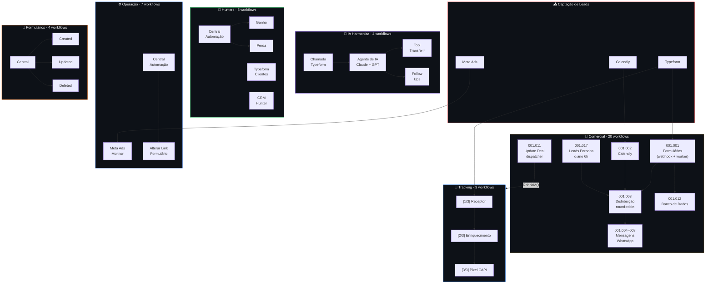
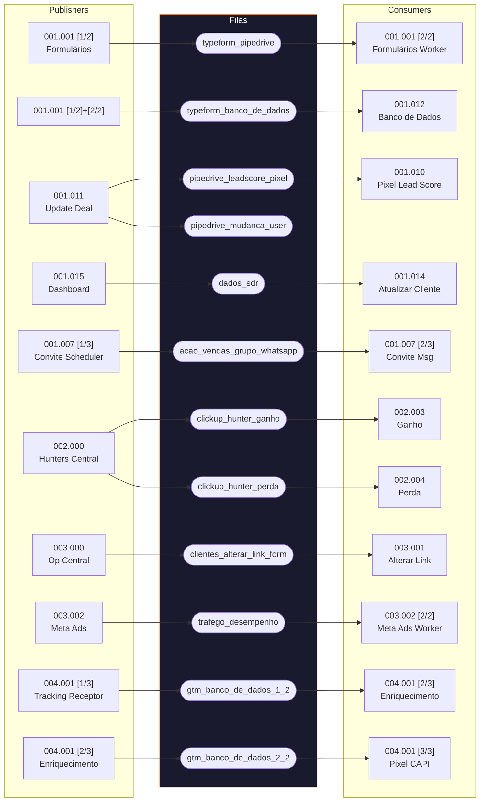

# Workflows

Inventário completo dos 41+ workflows n8n da HarmonizaPRO, organizados por departamento conforme a instância de produção (`workflows.goldeletra.pro`).

---

## Arquitetura Geral

---

## Inventário por Departamento

### 🤖 IA Harmoniza

| Workflow | ID | Status | Trigger | Nós |
|:---------|:---|:------:|:--------|----:|
| [Agente de IA](ia-harmoniza/agente-de-ia.md) | `8hdajgWAADbHorQF` | 🟢 | Webhook POST | 92 |
| [Chamada Typeform](ia-harmoniza/chamada-typeform.md) | `VPVYN9AzG8IGnKiR` | 🟢 | Webhook POST | 29 |
| [Tool Transferir](ia-harmoniza/tool-transferir.md) | `Gt60I1KPG4ReJSIe` | 🟢 | Webhook POST | 12 |
| [Fluxo Follow Ups](ia-harmoniza/fluxo-follow-ups.md) | `W1msnd1vZWkpFSDM` | 🔴 | Schedule 11min | 65 |

### 💼 Comercial

| # | Workflow | ID | Status | Trigger | Nós |
|--:|:---------|:---|:------:|:--------|----:|
| 001 | [Typeform Formulários [1/2]](comercial/typeform-formularios-1.md) | `0hGkd1W7Aqg8qUUH` | 🟢 | Webhook POST | 30 |
| 001 | [Typeform Formulários [2/2]](comercial/typeform-formularios-2.md) | `ut7SuyAS0AQ3bywe` | 🟢 | 🐇 `typeform_pipedrive` | 30 |
| 002 | [Calendly Event Create](comercial/calendly-event-create.md) | `EOeEGroKenTL6tm8` | 🟢 | Calendly Trigger | 48 |
| 003 | [Distribuição de Leads](comercial/distribuicao-leads.md) | `gTkwd0N0FUTUzo9q` | ⚙️ | Sub-workflow | 18 |
| 004 | [Envio Mensagem Parcial](comercial/envio-mensagem-parcial.md) | `iW5VeKzMhlHTiLTF` | ⚙️ | Sub-workflow | 23 |
| 005 | [Transferência de Leads](comercial/transferencia-leads.md) | `KTWEvow3Z8rGab9H` | 🟢 | Schedule | 17 |
| 006 | [Conversão de Campos](comercial/conversao-campos.md) | `1ZOJnFDLY7e8hV8j` | ⚙️ | Sub-workflow | 10 |
| 007 | [Convite Lead [1/3] Scheduler](comercial/convite-lead-1.md) | `EPj4uqLra763cKjD` | 🔴 | Schedule 30min | 11 |
| 007 | [Convite Lead [2/3] Mensagem](comercial/convite-lead-2.md) | `Av4GRQZkp71h41VX` | 🟢 | 🐇 `acao_vendas_grupo_whatsapp` | 13 |
| 007 | [Convite Lead [3/3] Resposta](comercial/convite-lead-3.md) | `Q8fXdJi9qhdmrs3l` | 🟢 | Webhook POST | 20 |
| 008 | [Envio Mensagem Clientes](comercial/envio-mensagem-clientes.md) | `VjXrQZZPivqrbNZM` | ⚙️ | Sub-workflow | 21 |
| 009 | [Documentar Msgs CRM](comercial/documentar-mensagens-crm.md) | `CJfeejjEkXAZwNeB` | 🟢 | Webhook POST | 34 |
| 010 | [Evento Pixel Lead Score](comercial/evento-pixel-lead-score.md) | `QEPP7Y3zLwbeOxta` | 🟢 | 🐇 `pipedrive_leadscore_pixel` | 21 |
| 011 | [Update Deal Dispatcher](comercial/pipedrive-update-deal.md) | `xawOX8VHRfM8AbwM` | 🟢 | Webhook POST | 10 |
| 012 | [Typeform Banco de Dados](comercial/typeform-banco-dados.md) | `nZU47kosH8E2FkJ5` | 🟢 | 🐇 `typeform_banco_de_dados` | 13 |
| 013 | [Evento Lead Clientes](comercial/evento-lead-clientes.md) | `SiBXX9WD2onuqIAR` | 🟢 | Webhook | 4 |
| 014 | [Atualizar Dados Cliente](comercial/atualizar-dados-cliente.md) | `4L3UoZGFAsWofZYx` | 🟢 | 🐇 `dados_sdr` | 9 |
| 015 | [Dashboard Planilha](comercial/dashboard-planilha-atualizada.md) | `cQ49sJd4FLFY5Jfz` | 🟢 | Schedule 23h45 | 6 |
| 016 | [Retroativo UTM](comercial/retroativo-utm.md) | `a5zLplTyFmXN5lgP` | 🔴 | Manual | 5 |
| 017 | [Leads Parados](comercial/leads-parados.md) | `hUgd3JCAuUFUh5e4` | 🟢 | Cron `0 6 * * *` | 10 |

### 🎯 Hunters

| # | Workflow | Status | Trigger | Nós |
|--:|:---------|:------:|:--------|----:|
| 000 | [Central de Automação](hunters/central-automacao.md) | 🟢 | ClickUp Trigger | 7 |
| 001 | [Typeform Clientes](hunters/typeform-clientes.md) | 🟢 | Webhook POST | 14 |
| 002 | [CRM Hunter](hunters/crm-hunter.md) | 🟢 | Webhook POST | 19 |
| 003 | [Ganho](hunters/ganho.md) | 🟢 | 🐇 `clickup_hunter_ganho` | 15 |
| 004 | [Perda](hunters/perda.md) | 🟢 | 🐇 `clickup_hunter_perda` | 11 |

### ⚙️ Operação

| # | Workflow | Status | Trigger | Nós |
|--:|:---------|:------:|:--------|----:|
| 000 | [Central de Automação](operacao/central-automacao.md) | 🟢 | ClickUp Trigger | 4 |
| 001 | [Alterar Link Formulário](operacao/alterar-link-formulario.md) | 🟢 | 🐇 `clientes_alterar_link_form` | 11 |
| 002 | [Desempenho Meta Ads](operacao/desempenho-meta-ads.md) | 🟢 | Schedule + RabbitMQ | 30 |
| 003 | [Retroativo Respostas](operacao/retroativo-respostas-banco.md) | 🔴 | Manual | 21 |
| — | [Retroativo Tarefas CRM](operacao/retroativo-tarefas-crm.md) | 🔴 | Manual | 10 |

### 📍 Tracking

| Parte | Workflow | ID | Status | Trigger | Nós |
|:-----:|:---------|:---|:------:|:--------|----:|
| 1/3 | [Receptor](tracking/gtm-typeform-1-receptor.md) | `AiL4nHZJqhVO1vR1` | 🟢 | Webhook POST | 6 |
| 2/3 | [Enriquecimento](tracking/gtm-typeform-2-enriquecimento.md) | `0E0NW4uGtYBeRwHF` | 🟢 | 🐇 `gtm_banco_de_dados_1_2` | 14 |
| 3/3 | [Pixel CAPI](tracking/gtm-typeform-3-pixel.md) | `cq6W0FsGX4IMNdtl` | 🟢 | 🐇 `gtm_banco_de_dados_2_2` | 19 |

### 📋 Templates

| # | Workflow | Descrição |
|--:|:---------|:----------|
| 001 | [Organizar ClickUp](templates/organizar-clickup.md) | Parser universal de custom fields — usado em 8+ workflows |
| 002 | [RabbitMQ](templates/rabbitmq.md) | Padrão consumer (dedup) + publisher (quorum) |

### 📝 Formulários ClickUp

| Parte | Workflow | Status | Trigger | Nós |
|:-----:|:---------|:------:|:--------|----:|
| 1/4 | [Central](clickup/formularios-1-central.md) | 🟢 | Webhook POST | 7 |
| 2/4 | [TaskCreated](clickup/formularios-2-created.md) | ⚙️ | Sub-workflow | 8 |
| 3/4 | [TaskDeleted](clickup/formularios-3-deleted.md) | ⚙️ | Sub-workflow | 10 |
| 4/4 | [TaskUpdated](clickup/formularios-4-updated.md) | ⚙️ | Sub-workflow | 9 |

!!! note "Legenda de Status"
    🟢 Ativo em produção · 🔴 Inativo / Manual · ⚙️ Sub-workflow (chamado por outros)

---

## Mapa de Filas RabbitMQ

Todas usam **quorum queues** (`durable: true`, `acknowledge: executionFinishesSuccessfully`, `parallelMessages: 1`).

---

## Mapa de Sub-workflows

| Sub-workflow | ID | Chamado por |
|:-------------|:---|:------------|
| 001.003 — Distribuição de Leads | `gTkwd0N0FUTUzo9q` | 001.002 (Calendly), 001.005 (Transferência), 001.017 (Parados) |
| 001.004 — Mensagem Parcial | `iW5VeKzMhlHTiLTF` | 001.005 (Transferência) |
| 001.006 — Conversão de Campos | `1ZOJnFDLY7e8hV8j` | 001.010 (Lead Score), 001.011 (Update Deal) |
| 001.008 — Envio Mensagem Clientes | `VjXrQZZPivqrbNZM` | Disponível para chamada |
| 005.001 — Organizar ClickUp | `YQiSPhl44vt3lYWl` | 8+ workflows (Hunters, Operação, Formulários) |
| 006.000 [2/4] — TaskCreated | `kastfiC5DE6IdNUd` | 006.000 [1/4] Central |
| 006.000 [3/4] — TaskDeleted | `jGfoGDdLSD7uJlww` | 006.000 [1/4] Central |
| 006.000 [4/4] — TaskUpdated | `HVMQTCfVDbSFnQJt` | 006.000 [1/4] Central |

---

## Webhooks Ativos

| Path | Workflow | Fonte |
|:-----|:---------|:------|
| `/typeform_pipedrive` | 001.001 [1/2] | Typeform |
| `/typeform_gtm` | 004.001 [1/3] | GTM / Typeform |
| `/pipedrive_update_deal` | 001.011 | Pipedrive Webhooks |
| `/documentar_msgs` | 001.009 | WhatsApp |
| `/quero_saber_mais` | 001.007 [3/3] | WhatsApp (botão) |
| `/response_clickup` | 006.000 [1/4] | ClickUp Webhooks |
| `/mensagem_dras` | 002.001 | Typeform Clientes |
| `/mensagens_hunter` | 002.002 | WhatsApp (Hunter) |
| UUID paths | 001.013, IA workflows | Diversos |

---

## Schedules Ativos

| Workflow | Frequência | Horário |
|:---------|:-----------|:--------|
| 001.005 — Transferência | Periódico | — |
| 001.007 [1/3] — Convite | A cada 30 min | 7h–21h BRT |
| 001.015 — Dashboard | Diário | 23h45 |
| 001.017 — Leads Parados | Diário | 06h00 |
| 003.002 — Meta Ads | Diário | — |
| Métricas Diárias | Diário | — |
| Monitoramento Custos | Semanal | — |
| Fluxo Follow Ups | A cada 11 min | (inativo) |

---

## Error Workflow Global

A maioria dos workflows usa o error workflow **`ByxX1TqYfyvlgp2T`** para captura centralizada de falhas. Nós de auto-registro TrackAble (`webhooks.autotrackable.com.br`) estão presentes mas desabilitados na maioria dos workflows.