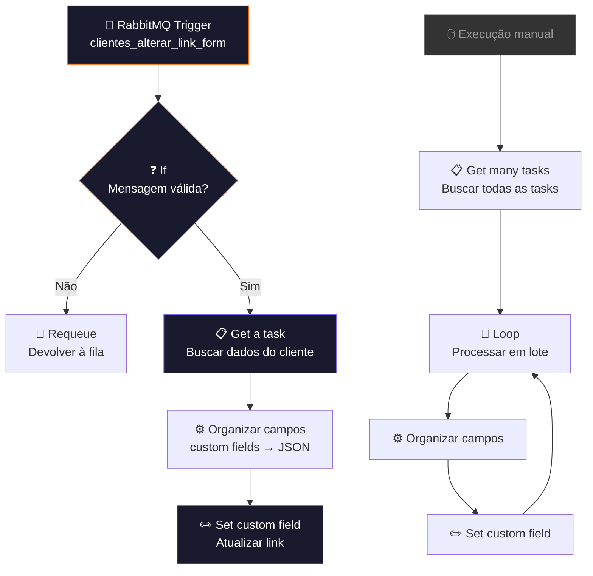
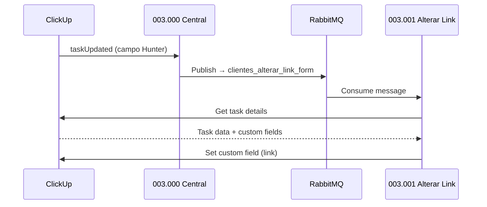

# 🔗 003.001 — Alterar Link do Formulário

!!! info "Visão Geral"
    Workerflow que consome a fila RabbitMQ `clientes_alterar_link_form`, busca os dados do cliente no ClickUp e atualiza o campo customizado de link do formulário nas tarefas relacionadas. Trabalha em par com o workflow `003.000 - Central de Automação`.

## Ficha Técnica

| Campo | Valor |
|:------|:------|
| **Nome** | 003.001 - Gestão de Clientes - Alterar Link do Formulário |
| **ID** | `NzmHd3edF1NQW1Re` |
| **Instância** | `workflows.goldeletra.pro` |
| **Status** | 🟢 Ativo |
| **Nós** | 11 |
| **Trigger** | RabbitMQ — fila `clientes_alterar_link_form` |
| **Dependências** | RabbitMQ, ClickUp |

---

## Arquitetura

---

## Nós em Detalhe

### 1. RabbitMQ Trigger
**Tipo:** `rabbitmqTrigger`

Consome mensagens da fila `clientes_alterar_link_form` publicadas pelo workflow 003.000.

| Parâmetro | Valor |
|:----------|:------|
| **Fila** | `clientes_alterar_link_form` |
| **Credencial** | `RabbitMQ` |

---

### 2. If — Validação
**Tipo:** `if` v2.2

Verifica se a mensagem contém dados válidos antes de prosseguir. Se inválida, devolve à fila (requeue).

---

### 3. Get a task
**Tipo:** `clickUp` v1

Busca os dados completos da task do cliente usando o `task_id` recebido na mensagem.

---

### 4. OrganizarClickUp
**Tipo:** `code` v2 (JavaScript)

Transforma os custom fields do ClickUp em um JSON estruturado, tratando diferentes tipos de campo (users, dropdown, labels, tasks, emoji).

---

### 5. Set a custom Field on a task
**Tipo:** `clickUp` v1

Atualiza o campo customizado de link do formulário na task do cliente.

---

### Fluxo alternativo: Execução em lote

O workflow também possui um fluxo de execução manual para processar todas as tasks em lote:

1. **Get many tasks** → busca todas as tasks da lista
2. **Loop Over Items** → processa uma por uma
3. **OrganizarClickUp1** → normaliza campos
4. **Set custom field** → atualiza cada task

---

## Integração com 003.000

---

## Credenciais

| Serviço | Credencial | Uso |
|:--------|:-----------|:----|
| RabbitMQ | `RabbitMQ` | Consumo de fila |
| ClickUp | `ClickUp - Ferramentas` | Leitura e escrita de tasks |

---

## Troubleshooting

| Problema | Causa | Solução |
|:---------|:------|:--------|
| Mensagens acumulando na fila | Worker parado | Verificar se workflow está ativo |
| Task não encontrada | `task_id` inválido | Verificar payload do 003.000 |
| Custom field não atualiza | ID do campo desatualizado | Comparar IDs no ClickUp |
| Requeue infinito | Mensagem corrompida | Verificar dead letter queue no RabbitMQ |