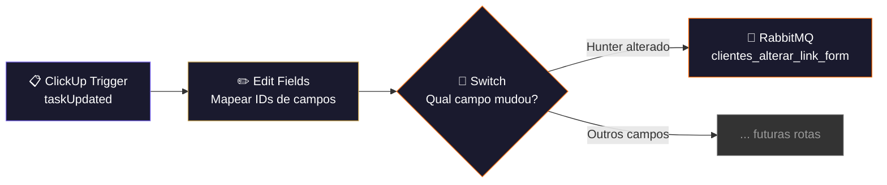

# 🎛️ 003.000 — Central de Automação

!!! info "Visão Geral"
    Workflow central que escuta atualizações no CRM (ClickUp) e roteia eventos para filas RabbitMQ específicas. Funciona como um **dispatcher**: quando um campo customizado é alterado na lista de clientes, identifica qual ação executar e publica na fila correspondente.

## Ficha Técnica

| Campo | Valor |
|:------|:------|
| **Nome** | 003.000 - Gestão de Clientes - Central de Automação |
| **ID** | `fzZOWOWQ7UZgw3oa` |
| **Instância** | `workflows.goldeletra.pro` |
| **Status** | 🟢 Ativo |
| **Nós** | 4 |
| **Trigger** | ClickUp Trigger — `taskUpdated` na lista `901325472193` |
| **Dependências** | ClickUp, RabbitMQ |

---

## Arquitetura

---

## Nós em Detalhe

### 1. ClickUp Trigger
**Tipo:** `clickUpTrigger` v1

Escuta o evento `taskUpdated` no workspace `90132992412`, filtrado para a lista de clientes `901325472193`.

| Parâmetro | Valor |
|:----------|:------|
| **Evento** | `taskUpdated` |
| **Team** | `90132992412` |
| **Lista** | `901325472193` (Gestão de Clientes) |
| **Credencial** | `ClickUp - Ferramentas` |

O payload inclui `history_items` com o campo customizado alterado, o valor anterior e o novo.

---

### 2. Edit Fields
**Tipo:** `set` v3.4

Mapeia os IDs dos campos customizados do ClickUp em variáveis legíveis para facilitar a comparação no Switch.

| Variável | ID do Campo | Significado |
|:---------|:------------|:------------|
| `Campo Hunter` | `3c3c0d40-a8c3-4f3c-b517-edd7136de137` | Campo "Hunter" (tipo: users) |
| `Campo Formulário` | `5b76bed9-8cf5-4fae-85ed-d1674cd8cdaf` | Campo "Formulário" |
| `task_id` | Dinâmico | ID da task atualizada |

---

### 3. Switch
**Tipo:** `switch` v3.4

Compara o ID do campo customizado alterado com os IDs mapeados para decidir a rota:

| Condição | Saída |
|:---------|:------|
| Campo alterado = Campo Hunter | → "Alterar Link" |
| *Outros campos (futuro)* | → *Novas rotas* |

---

### 4. RabbitMQ — Alterar Link
**Tipo:** `rabbitmq` v1.1

Publica a mensagem na fila `clientes_alterar_link_form` para consumo pelo workflow `003.001`.

| Parâmetro | Valor |
|:----------|:------|
| **Fila** | `clientes_alterar_link_form` |
| **Tipo** | Quorum (alta disponibilidade) |
| **Durável** | Sim |
| **Credencial** | `RabbitMQ` |

---

## Padrão Arquitetural: Event-Driven

Este workflow implementa o padrão **Event → Router → Queue**:

1. **ClickUp** dispara evento quando um campo muda
2. **Central de Automação** identifica qual campo e roteia
3. **RabbitMQ** desacopla o evento do processamento
4. **Worker** (003.001) consome a fila e executa a ação

Isso permite adicionar novas ações sem modificar o trigger — basta criar uma nova saída no Switch e um novo worker.

---

## Troubleshooting

| Problema | Causa | Solução |
|:---------|:------|:--------|
| Trigger não dispara | Webhook não registrado no ClickUp | Reativar o workflow no n8n |
| Mensagem não chega na fila | RabbitMQ offline | Verificar `rabbitmq.goldeletra.pro` |
| Switch não roteia | ID do campo mudou no ClickUp | Atualizar IDs no nó Edit Fields |