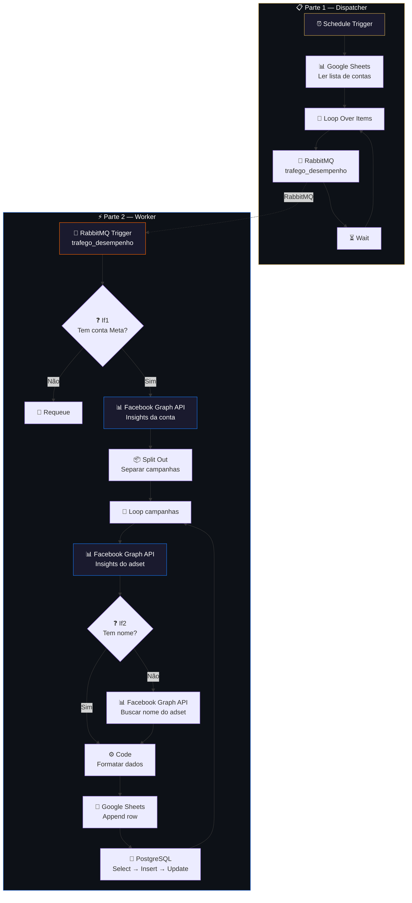

# 📊 003.002 — Desempenho Meta Ads

!!! info "Visão Geral"
    Sistema de duas partes que coleta métricas de desempenho do Meta Ads (Facebook/Instagram) de todas as contas de clientes, processa os dados via Facebook Graph API e salva em Google Sheets + PostgreSQL. Roda automaticamente via schedule.

## Ficha Técnica

### Parte 1 — Dispatcher (003.002)

| Campo | Valor |
|:------|:------|
| **Nome** | 003.002 - [1/2] - 001.010 - Desempenho Meta Ads |
| **ID** | `aDQOPpXXYXvwsWGN` |
| **Status** | 🟢 Ativo |
| **Nós** | 8 (3 desabilitados) |
| **Trigger** | Schedule Trigger (automático) |
| **Dependências** | Google Sheets, RabbitMQ |

### Parte 2 — Worker (Tráfego)

| Campo | Valor |
|:------|:------|
| **Nome** | Tráfego - [2/2] - Desempenho Meta Ads |
| **ID** | `lI8UCdSfpy7Z9ZpU` |
| **Status** | 🟢 Ativo |
| **Nós** | 22 |
| **Trigger** | RabbitMQ — fila `trafego_desempenho` |
| **Dependências** | RabbitMQ, Facebook Graph API, Google Sheets, PostgreSQL |

---

## Arquitetura Completa



---

## Parte 1 — Dispatcher

### Fluxo

1. **Schedule Trigger** — dispara automaticamente no horário configurado
2. **Google Sheets** — lê a planilha com a lista de contas Meta Ads dos clientes (Act ID, nome, etc.)
3. **Loop Over Items** — itera sobre cada conta
4. **RabbitMQ** — publica cada conta na fila `trafego_desempenho`
5. **Wait** — aguarda entre publicações para não sobrecarregar

### Planilha de Contas

A planilha no Google Sheets contém a lista de contas Meta Ads de cada cliente com os campos necessários para consulta.

### Credenciais

| Serviço | Credencial |
|:--------|:-----------|
| Google Sheets | `ferramentas@harmoniza.pro` |
| RabbitMQ | `RabbitMQ` |

---

## Parte 2 — Worker

### Fluxo detalhado

**1. Consumo da fila**

O worker consome mensagens da fila `trafego_desempenho` com os dados da conta Meta Ads.

**2. Consulta Facebook Graph API (nível conta)**

```
GET https://graph.facebook.com/v24.0/{act_id}/insights
```

Busca métricas agregadas da conta (impressões, cliques, gastos, conversões).

**3. Split por campanha/adset**

Separa os resultados em campanhas individuais e itera sobre cada adset.

**4. Consulta Facebook Graph API (nível adset)**

```
GET https://graph.facebook.com/v24.0/{adset_id}/insights
```

Busca métricas detalhadas por adset. Se o nome não está disponível, faz uma chamada adicional:

```
GET https://graph.facebook.com/v24.0/{adset_id}
```

**5. Formatação e salvamento**

O nó **Code** formata os dados para salvar em duas camadas:

- **Google Sheets** → `Append row` (histórico acessível ao time)
- **PostgreSQL** → `Insert/Update` no banco `Metricas - Clientes` (dados estruturados para dashboards)

### Rate limiting

O workflow inclui múltiplos nós **Wait** para respeitar os limites da Graph API:

| Nó | Propósito |
|:---|:----------|
| `Wait` | Entre chamadas de adset insights |
| `Wait1` | Retry após rate limit na conta |
| `Wait2` | Retry após rate limit no adset |
| `Wait3` | Entre appends no Google Sheets |

### Credenciais

| Serviço | Credencial | Uso |
|:--------|:-----------|:----|
| RabbitMQ | `RabbitMQ` | Consumo e requeue |
| Facebook Graph API | `Facebook Graph` | Meta Ads insights |
| Google Sheets | `ferramentas@harmoniza.pro` | Salvar resultados |
| PostgreSQL | `Metricas - Clientes` | Dados estruturados |

---

## Dados Coletados

| Métrica | Nível | Descrição |
|:--------|:------|:----------|
| Impressões | Conta / Adset | Total de impressões |
| Cliques | Conta / Adset | Total de cliques |
| Gasto | Conta / Adset | Valor investido (R$) |
| CTR | Adset | Click-through rate |
| CPM | Adset | Custo por mil impressões |
| CPC | Adset | Custo por clique |
| Conversões | Adset | Ações de conversão |

---

## Troubleshooting

| Problema | Causa | Solução |
|:---------|:------|:--------|
| Graph API 403 | Token expirado | Renovar token no Facebook Developer |
| Graph API 429 | Rate limit | Aumentar tempo nos nós Wait |
| Planilha sem dados | Conta sem campanhas ativas | Normal — verificar no Meta Ads Manager |
| PostgreSQL connection refused | Banco offline | Verificar `Metricas - Clientes` |
| Dados duplicados no Sheets | Re-execução do worker | Verificar lógica de dedup no PostgreSQL |