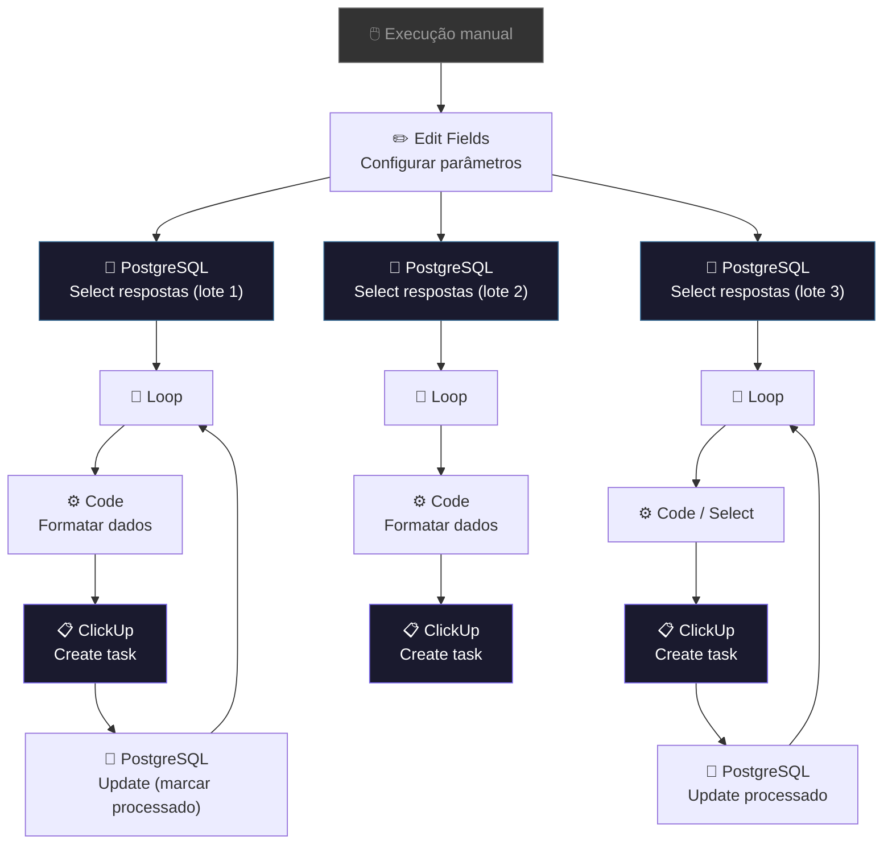

# 🔄 003.003 — Retroativo: Respostas do Banco no ClickUp

!!! info "Visão Geral"
    Workflow de migração retroativa que lê respostas armazenadas no PostgreSQL e cria as tasks correspondentes no ClickUp. Utilizado para sincronizar dados históricos que não passaram pela automação em tempo real. Execução manual sob demanda.

## Ficha Técnica

| Campo | Valor |
|:------|:------|
| **Nome** | 003.003 - Retroativo - Adicionar Respostas do Banco no Clickup |
| **ID** | `Dz3o1dy9UZ0fb4ez` |
| **Instância** | `workflows.goldeletra.pro` |
| **Status** | 🔴 Inativo (execução manual) |
| **Nós** | 21 (1 desabilitado) |
| **Trigger** | Manual — botão "Execute workflow" |
| **Dependências** | PostgreSQL, ClickUp |

---

## Arquitetura

O workflow possui 3 pipelines paralelos para processar diferentes tipos/lotes de respostas.

---

## Fluxo

### Pipeline padrão (por lote)

1. **Edit Fields** — configura parâmetros de busca (filtros, limites)
2. **Select rows from table** — busca respostas pendentes no PostgreSQL
3. **Loop Over Items** — processa uma resposta por vez
4. **Code (JavaScript)** — formata os dados da resposta para o formato do ClickUp
5. **Create a task** — cria a task no ClickUp com os campos customizados preenchidos
6. **Update rows** — marca a resposta como processada no banco (evita reprocessamento)
7. Volta ao Loop para a próxima resposta

### Por que 3 pipelines?

O workflow divide o processamento em 3 lotes para lidar com diferentes tipos de respostas ou períodos. Cada pipeline busca de queries SQL diferentes e cria tasks em listas potencialmente diferentes.

---

## Credenciais

| Serviço | Credencial | Uso |
|:--------|:-----------|:----|
| PostgreSQL | `Metricas - Clientes` | Leitura de respostas e marcação de processados |
| ClickUp | `ClickUp - Ferramentas` | Criação de tasks |

---

## Quando Usar

| Cenário | Ação |
|:--------|:-----|
| Respostas antigas não sincronizadas | Executar manualmente |
| Migração de dados de outro sistema | Adaptar queries SQL e executar |
| Re-sincronização após falha | Executar — registros já processados são ignorados |

!!! warning "Cuidado"
    Este workflow cria tasks no ClickUp. Execute com cuidado para evitar duplicatas. O campo `processado` no PostgreSQL previne reprocessamento, mas verifique antes de executar.

---

## Troubleshooting

| Problema | Causa | Solução |
|:---------|:------|:--------|
| Nenhuma resposta retornada | Todas já foram processadas | Verificar coluna `processado` no banco |
| Rate limit do ClickUp | Muitas tasks por minuto | Adicionar nó Wait entre criações |
| Task criada sem campos | Formato de dados incorreto | Verificar output do nó Code |
| Duplicatas no ClickUp | Workflow executado 2x | Verificar flag `processado` no PostgreSQL |