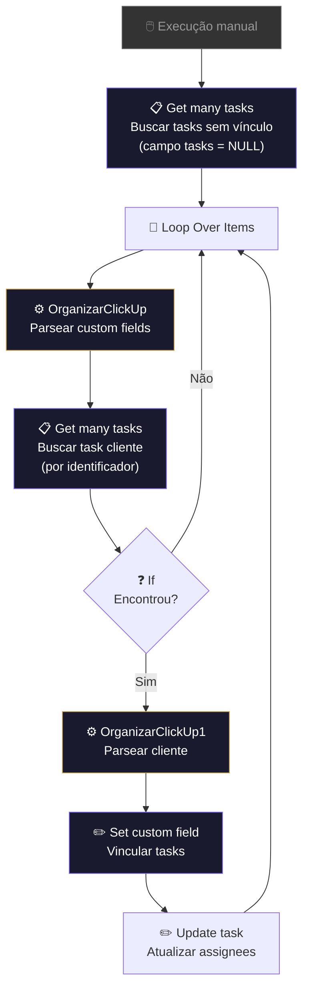

# 🔄 Retroativo: Tarefas do CRM

!!! info "Visão Geral"
    Workflow de manutenção que sincroniza tarefas entre listas do CRM no ClickUp. Busca tasks sem relacionamento definido (campo `tasks` vazio), localiza a task correspondente na lista de clientes pelo campo identificador e cria o vínculo bidirecional. Execução manual sob demanda.

## Ficha Técnica

| Campo | Valor |
|:------|:------|
| **Nome** | Retroativo - Tarefas do CRM |
| **ID** | `kXhVhI0XUXw80hnm` |
| **Instância** | `workflows.goldeletra.pro` |
| **Status** | 🔴 Inativo (execução manual) |
| **Nós** | 10 |
| **Trigger** | Manual — botão "Execute workflow" |
| **Dependências** | ClickUp |

---

## Arquitetura

---

## Fluxo Detalhado

### 1. Buscar tasks pendentes
Busca todas as tasks no CRM (lista `901324875324`) onde o campo de relação (`e87f9cee-8d4e-440b-9d97-c362aadd7419`) é `NULL` — ou seja, tasks que ainda não foram vinculadas a um cliente.

| Parâmetro | Valor |
|:----------|:------|
| **Space** | `901313001557` |
| **Folder** | `901316722258` |
| **Lista** | `901324875324` |
| **Filtro** | Custom field `IS NULL` |

### 2. Organizar dados
O nó **Code** (JavaScript) transforma os custom fields do ClickUp em JSON estruturado, tratando tipos: `users`, `drop_down`, `labels`, `tasks`, `emoji`.

### 3. Buscar task do cliente
Com o identificador extraído da task CRM (campo `e2a18d27-8adc-4112-b9d4-8c3685b78a23`), busca a task correspondente na lista de gestão de clientes (`901325472193`).

### 4. Vincular
Se encontrou o cliente:

- **Set custom field** → adiciona o `task_id` do cliente no campo de relação da task CRM
- **Update task** → copia os assignees (Hunters) do cliente para a task CRM

Se não encontrou → pula para a próxima task no loop.

---

## Campos Customizados Envolvidos

| Campo | ID | Tipo | Descrição |
|:------|:---|:-----|:----------|
| Relação de tasks | `e87f9cee-8d4e-440b-9d97-c362aadd7419` | tasks | Vínculo entre task CRM e cliente |
| Identificador | `e2a18d27-8adc-4112-b9d4-8c3685b78a23` | — | Campo usado para match entre listas |
| Hunter | `3c3c0d40-a8c3-4f3c-b517-edd7136de137` | users | Hunters atribuídos ao cliente |

---

## Credenciais

| Serviço | Credencial | Uso |
|:--------|:-----------|:----|
| ClickUp | `ClickUp - Ferramentas` | Leitura e escrita de tasks e custom fields |

---

## Quando Usar

| Cenário | Ação |
|:--------|:-----|
| Tasks do CRM sem vínculo com cliente | Executar manualmente |
| Após importação em massa de tasks | Executar para vincular |
| Assignees desincronizados | Executar para recopiar |

!!! note "Nó desabilitado"
    O nó `Update a task2` está desabilitado. Quando habilitado, ele copia os assignees do Hunter para a task CRM. Habilite conforme necessidade.

---

## Troubleshooting

| Problema | Causa | Solução |
|:---------|:------|:--------|
| Nenhuma task retornada | Todas já vinculadas | Normal — campo não é mais NULL |
| Match não encontrado | Identificador diferente entre listas | Verificar campo `e2a18d27` nas duas listas |
| Loop infinito | Task não encontra correspondente | O `If` redireciona para o loop automaticamente |
| Rate limit ClickUp | Muitas requests por minuto | Adicionar nó Wait entre iterações |