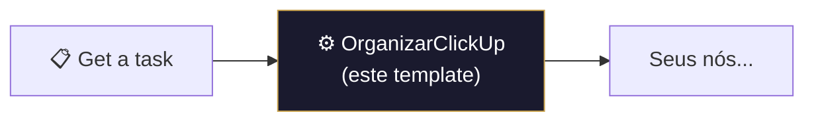

# ⚙️ 005.001 — Template: Node Organizar ClickUp

!!! info "Visão Geral"
    Template reutilizável que transforma os custom fields brutos do ClickUp em um JSON estruturado e acessível. Usado em praticamente todos os workflows que leem dados do ClickUp. É o "parser universal" de custom fields da HarmonizaPRO.

## Ficha Técnica

| Campo | Valor |
|:------|:------|
| **Nome** | 005.001 - Template - Node Organizar Clickup |
| **ID** | `YQiSPhl44vt3lYWl` |
| **Instância** | `workflows.goldeletra.pro` |
| **Status** | 🔴 Inativo (template) |
| **Nós** | 1 |
| **Tag** | `Template` |
| **onError** | `continueRegularOutput` |

---

## Uso

Copie o nó `OrganizarClickUp` para qualquer workflow que precise ler custom fields do ClickUp. Ele deve ser colocado **logo após** um nó `Get a task` ou `Get many tasks`.



---

## Entrada Esperada

O nó espera receber o output padrão de um nó ClickUp `Get a task`:

```json
{
  "id": "86af2b16q",
  "name": "Nome da Task",
  "status": { "status": "open" },
  "custom_fields": [
    {
      "id": "uuid-do-campo",
      "name": "Nome do Campo",
      "type": "users|drop_down|labels|tasks|emoji|...",
      "value": "...",
      "type_config": { "options": [...] }
    }
  ]
}
```

---

## Saída Gerada

JSON limpo com `task_id`, `name`, `status` e cada custom field mapeado pelo seu UUID:

```json
{
  "task_id": "86af2b16q",
  "name": "Nome da Task",
  "status": "open",
  "3c3c0d40-...": {
    "id": "3c3c0d40-...",
    "name": "Hunter",
    "value": {
      "geral": "278505381",
      "278505381": {
        "id": "278505381",
        "name": "Fulano",
        "email": "fulano@harmoniza.pro"
      }
    }
  },
  "21511f56-...": {
    "id": "21511f56-...",
    "name": "Motivo da Perda",
    "value": "",
    "options": {
      "opt-id-1": { "id": "opt-id-1", "name": "Preço" },
      "opt-id-2": { "id": "opt-id-2", "name": "Concorrente" }
    }
  }
}
```

---

## Tipos de Campo Tratados

| Tipo ClickUp | Tratamento | Output |
|:-------------|:-----------|:-------|
| `users` | Extrai IDs e detalhes de cada usuário | `{ geral: "id1,id2", id1: { name, email }, ... }` |
| `drop_down` | Busca opção pelo `orderindex` | `{ id, name, value }` |
| `labels` | Mapeia IDs para nomes e cores | `[{ id, name, color }, ...]` |
| `tasks` | Extrai ID, nome e status de cada task vinculada | `[{ id, name, status }, ...]` |
| `emoji` | Retorna valor direto ou string vazia | `"⭐"` ou `""` |
| **Outros** | Retorna `value` direto ou `""` se nulo | Valor primitivo |

Campos com `type_config.options` recebem um objeto `options` adicional mapeando todas as opções disponíveis.

---

## Workflows que Usam Este Template

| Workflow | Nó |
|:---------|:---|
| 002.000 - Hunters - Central | `OrganizarClickUp` |
| 002.001 - Typeform Clientes | `OrganizarClickUp` |
| 002.003 - Hunters - Ganho | `OrganizarClickUp`, `OrganizarClickUp1` |
| 002.004 - Hunters - Perda | `OrganizarClickUp` |
| 003.000 - Gestão de Clientes | `OrganizarClickUp` |
| 003.001 - Alterar Link | `OrganizarClickUp`, `OrganizarClickUp1` |
| 003.003 - Retroativo Respostas | `OrganizarClickUp` |
| Retroativo - Tarefas CRM | `OrganizarClickUp`, `OrganizarClickUp1` |

---

## Código Fonte Completo

```javascript
const jsonData = items[0].json;
const customFields = jsonData.custom_fields;
const result = {
  task_id: jsonData.id,
  name: jsonData.name,
  status: jsonData.status.status
};

customFields.forEach(field => {
  const fieldId = field.id;
  let fieldValue;
  let fieldObject = { id: fieldId, name: field.name };

  if (field.type === 'users' && Array.isArray(field.value)) {
    const allIds = field.value.map(user => user.id).join(',');
    const userDetails = {};
    field.value.forEach(user => {
      userDetails[user.id] = {
        id: user.id, name: user.username, email: user.email
      };
    });
    fieldValue = { geral: allIds, ...userDetails };

  } else if (field.type === 'drop_down' && field.value != null) {
    const opt = field.type_config.options.find(
      o => o.orderindex === field.value
    );
    fieldValue = opt
      ? { id: opt.id, name: opt.name, value: opt.orderindex }
      : '';

  } else if (field.type === 'labels' && Array.isArray(field.value)) {
    fieldValue = field.value.map(optId => {
      const opt = field.type_config.options.find(o => o.id === optId);
      return opt ? { id: opt.id, name: opt.label, color: opt.color } : null;
    }).filter(Boolean);

  } else if (field.type === 'tasks' && Array.isArray(field.value)) {
    fieldValue = field.value.map(t => ({
      id: t.id, name: t.name, status: t.status
    }));

  } else if (field.type === 'emoji') {
    fieldValue = field.value || '';

  } else {
    fieldValue = field.value != null ? field.value : '';
  }

  fieldObject.value = fieldValue;

  if (field.type_config?.options) {
    const options = {};
    field.type_config.options.forEach(opt => {
      options[opt.id] = { id: opt.id, name: opt.label || opt.name };
    });
    if (Object.keys(options).length > 0) {
      fieldObject.options = options;
    }
  }

  result[fieldId] = fieldObject;
});

return [{ json: result }];
```

---

## Notas

!!! tip "Boas práticas"
    - O nó usa `onError: continueRegularOutput` — se um campo falhar, o workflow continua normalmente
    - Para acessar um campo após o parser: `$json["uuid-do-campo"].value`
    - Para acessar opções disponíveis: `$json["uuid-do-campo"].options`