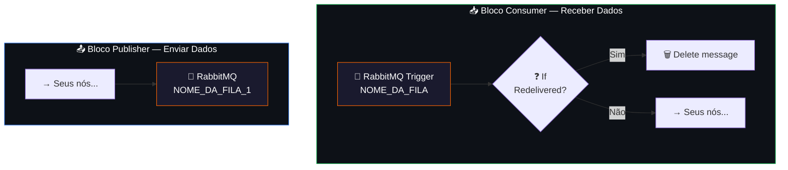

# 🐇 005.002 — Template: RabbitMQ

!!! info "Visão Geral"
    Template reutilizável com o padrão de consumer e publisher RabbitMQ da HarmonizaPRO. Inclui o trigger com dedup de mensagens (redelivered check) e o publisher com quorum queue. Copie os nós para qualquer workflow que precise se comunicar via filas.

## Ficha Técnica

| Campo | Valor |
|:------|:------|
| **Nome** | 005.002 - Template - RabbitMQ |
| **ID** | `ZYFguW4YlvtptUum` |
| **Instância** | `workflows.goldeletra.pro` |
| **Status** | 🔴 Inativo (template) |
| **Nós** | 6 (4 funcionais + 2 sticky notes) |
| **Tag** | `Template` |
| **Credencial** | `RabbitMQ` |

---

## Componentes

O template contém dois blocos independentes para copiar conforme necessidade:



---

## Bloco 1: Consumer (Receber Dados)

### Nós inclusos

**Webhook (RabbitMQ Trigger)**

| Parâmetro | Valor | O que mudar |
|:----------|:------|:------------|
| **Queue** | `NOME_DA_FILA` | ⚠️ Substituir pelo nome real |
| **Tipo** | Quorum | Manter |
| **Acknowledge** | On execution success | Manter |
| **JSON Parse** | Sim | Manter |
| **Only Content** | Não (recebe headers também) | Manter |
| **Parallel Messages** | 1 | Ajustar se necessário |

**If (Dedup)**

Verifica `$json.fields.redelivered`:

- **True** → mensagem já foi entregue antes → **Delete message** (descarta)
- **False** → primeira entrega → segue para processamento

**RabbitMQ1 (Delete)**

Operação `deleteMessage` — remove a mensagem da fila quando é uma reentrega.

### Como usar

1. Copie os 3 nós (`Webhook`, `If`, `RabbitMQ1`) para o seu workflow
2. Substitua `NOME_DA_FILA` pelo nome real da fila
3. Conecte a saída **False** do `If` aos seus nós de processamento

---

## Bloco 2: Publisher (Enviar Dados)

### Nó incluso

**RabbitMQ (Publish)**

| Parâmetro | Valor | O que mudar |
|:----------|:------|:------------|
| **Queue** | `NOME_DA_FILA_1` | ⚠️ Substituir pelo nome real |
| **Tipo** | Quorum | Manter |
| **Durável** | Sim | Manter |

### Como usar

1. Copie o nó `RabbitMQ` para o seu workflow
2. Substitua `NOME_DA_FILA_1` pelo nome real da fila
3. Conecte a entrada ao nó que produz os dados a serem publicados

---

## Padrão de Filas da HarmonizaPRO

Todas as filas seguem estas convenções:

| Regra | Valor |
|:------|:------|
| **Tipo** | Quorum (alta disponibilidade) |
| **Durável** | Sempre |
| **Acknowledge** | Ao final da execução (não automático) |
| **Dedup** | Via check `redelivered` no consumer |
| **Paralelismo** | 1 mensagem por vez (padrão) |

### Filas em produção

| Fila | Publisher | Consumer |
|:-----|:---------|:---------|
| `clickup_hunter_ganho` | 002.000 | 002.003 |
| `clickup_hunter_perda` | 002.000 | 002.004 |
| `clientes_alterar_link_form` | 003.000 | 003.001 |
| `trafego_desempenho` | 003.002 [1/2] | Tráfego [2/2] |

---

## Exemplo: Criando um novo par Publisher/Consumer

### Publisher (no workflow dispatcher)

```
[Seu Trigger] → [Lógica] → [RabbitMQ: minha_nova_fila]
```

### Consumer (novo workflow worker)

```
[RabbitMQ Trigger: minha_nova_fila] → [If: redelivered?]
  ├── True → [Delete message]
  └── False → [Sua lógica de processamento]
```

---

## Notas

!!! tip "Por que Quorum Queues?"
    Quorum queues replicam dados entre nós do cluster RabbitMQ, garantindo que mensagens não sejam perdidas mesmo em caso de falha de um nó. São o padrão recomendado para filas duráveis desde o RabbitMQ 3.8+.

!!! warning "Redelivered ≠ Duplicata"
    O check de `redelivered` protege contra reprocessamento quando o RabbitMQ reentrega uma mensagem (ex: consumer caiu antes de ack). Não protege contra o publisher enviar a mesma mensagem 2 vezes — para isso, implemente idempotência no consumer.