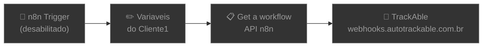

# 📥 004.001 [1/3] — GTM Typeform: Receptor

!!! info "Visão Geral"
    Primeiro estágio do pipeline de tracking server-side. Recebe envios do Typeform via webhook e publica imediatamente na fila RabbitMQ para processamento assíncrono. Resposta rápida (< 200ms) garante que o Typeform não sofra timeout.

## Ficha Técnica

| Campo | Valor |
|:------|:------|
| **Nome** | 004.001 - [1/3] - Google Tag Manager - Typeform |
| **ID** | `AiL4nHZJqhVO1vR1` |
| **Instância** | `workflows.goldeletra.pro` |
| **Status** | 🟢 Ativo |
| **Nós** | 6 (1 desabilitado) |
| **Trigger** | Webhook POST `/typeform_gtm` |
| **Error Workflow** | `ByxX1TqYfyvlgp2T` |
| **Tags** | `OK`, `Cadastrado`, `Documentado` |

---

## Arquitetura


---

## Fluxo Principal

Apenas 2 nós no caminho crítico — ultra simples por design:

### 1. Webhook
**Tipo:** `webhook` v2

| Parâmetro | Valor |
|:----------|:------|
| **Método** | POST |
| **Path** | `/typeform_gtm` |

Recebe o payload completo do Typeform (dados do formulário, metadata, UTMs, cookies `fbc`/`fbp`).

### 2. BancoDeDados (RabbitMQ Publish)
**Tipo:** `rabbitmq` v1.1

| Parâmetro | Valor |
|:----------|:------|
| **Fila** | `gtm_banco_de_dados_1_2` |
| **Tipo** | Quorum |
| **Durável** | Sim |

Publica o payload inteiro na fila para a Parte 2 consumir.

---

## Fluxo Secundário: Auto-registro TrackAble

Nós para registro automático no sistema de monitoramento externo (trigger desabilitado):



### Variáveis do Cliente

| Variável | Valor | Descrição |
|:---------|:------|:----------|
| Pasta Cliente | `901312698708` | Folder ClickUp |
| Fluxos com Erro | `901319151056` | Lista de erros |
| Fluxos Cadastrados | `901319151049` | Lista OK |
| Tarefa Cliente ID | `86ac2h7bc` | Task do cliente |
| Nome do Fluxo | `$workflow.name` | Dinâmico |
| Link N8N | Dinâmico | URL do workflow |
| ID Página Fluxos | `c9pay-8513` | Página ClickUp |
| ID Documento | `c9pay-15913` | Doc ClickUp |

---

## Posição no Pipeline

```
[1/3] Receptor  →  [2/3] Enriquecimento  →  [3/3] Disparo Pixel
  ▲ VOCÊ ESTÁ AQUI
```

| Fila | Direção | Destino |
|:-----|:--------|:--------|
| `gtm_banco_de_dados_1_2` | Publica → | Parte 2 consome |

---

## Credenciais

| Serviço | Credencial | Uso |
|:--------|:-----------|:----|
| RabbitMQ | `RabbitMQ` | Publish na fila |
| n8n API | `n8n account` | Auto-registro (desabilitado) |

---

## Troubleshooting

| Problema | Causa | Solução |
|:---------|:------|:--------|
| Typeform não envia | URL do webhook errada | Verificar path `/typeform_gtm` no Typeform |
| Fila não recebe | RabbitMQ offline | Checar serviço RabbitMQ |
| Webhook timeout | Workflow inativo | Reativar no n8n |