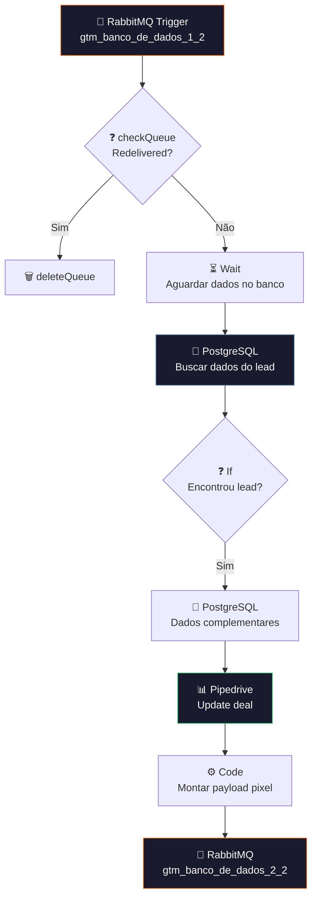

# 🔍 004.001 [2/3] — GTM Typeform: Enriquecimento

!!! info "Visão Geral"
    Segundo estágio do pipeline de tracking. Consome dados brutos do Typeform, busca informações complementares no PostgreSQL, atualiza o deal no Pipedrive com dados de tracking e monta o payload enriquecido para disparo do Facebook Pixel na Parte 3.

## Ficha Técnica

| Campo | Valor |
|:------|:------|
| **Nome** | 004.001 - [2/3] - Google Tag Manager - Typeform |
| **ID** | `0E0NW4uGtYBeRwHF` |
| **Instância** | `workflows.goldeletra.pro` |
| **Status** | 🟢 Ativo |
| **Nós** | 14 |
| **Trigger** | RabbitMQ — fila `gtm_banco_de_dados_1_2` |
| **Error Workflow** | `ByxX1TqYfyvlgp2T` |
| **Tags** | `OK`, `Cadastrado` |

---

## Arquitetura



---

## Nós em Detalhe

### 1. RabbitMQ Trigger
Consome da fila `gtm_banco_de_dados_1_2` (publicada pela Parte 1).

| Parâmetro | Valor |
|:----------|:------|
| **Fila** | `gtm_banco_de_dados_1_2` |
| **Tipo** | Quorum |
| **Acknowledge** | On execution success |
| **JSON Parse** | Sim |
| **Parallel Messages** | 1 |

### 2. checkQueue (If)
Verifica `redelivered` — se a mensagem já foi entregue antes, descarta via `deleteQueue`.

### 3. Wait
Delay entre consumo e query — garante que os dados do lead já foram persistidos no banco pelo Typeform antes da busca.

### 4. PostgreSQL — Buscar lead
**Credencial:** `Postgres - Metricas`

Executa query SQL para buscar os dados do lead associado ao envio do Typeform.

### 5. If — Encontrou?
Se o lead não foi encontrado no banco, o fluxo para. Se encontrou, continua para enriquecimento.

### 6. PostgreSQL — Dados complementares
Segunda query para buscar dados adicionais necessários para o payload do pixel.

### 7. Pipedrive — Update deal
Atualiza o deal no Pipedrive com informações de tracking (UTMs, source, etc.).

**Credencial:** `Pipedrive - evoluamidia@gmail.com`

### 8. Code — Montar payload
JavaScript que monta o payload final com todos os dados necessários para o disparo do pixel: dados do lead, UTMs, cookies, config do pixel, etc.

### 9. RabbitMQ — EventoPixel
Publica o payload enriquecido na fila `gtm_banco_de_dados_2_2` para a Parte 3.

---

## Posição no Pipeline

```
[1/3] Receptor  →  [2/3] Enriquecimento  →  [3/3] Disparo Pixel
                     ▲ VOCÊ ESTÁ AQUI
```

| Fila | Direção | Contraparte |
|:-----|:--------|:------------|
| `gtm_banco_de_dados_1_2` | ← Consome | Parte 1 publica |
| `gtm_banco_de_dados_2_2` | Publica → | Parte 3 consome |

---

## Credenciais

| Serviço | Credencial | Uso |
|:--------|:-----------|:----|
| RabbitMQ | `RabbitMQ` | Consumer + publisher |
| PostgreSQL | `Postgres - Metricas` | Dados do lead |
| Pipedrive | `Pipedrive - evoluamidia@gmail.com` | Update deal |
| n8n API | `n8n account` | Auto-registro TrackAble (desabilitado) |

---

## Troubleshooting

| Problema | Causa | Solução |
|:---------|:------|:--------|
| Lead não encontrado | Delay insuficiente | Aumentar tempo no nó Wait |
| Pipedrive 401 | OAuth expirado | Renovar token OAuth Pipedrive |
| Fila 2_2 não recebe | Nó Code falhou | Verificar payload gerado |
| Mensagens acumulando | Worker parado | Verificar se workflow está ativo |