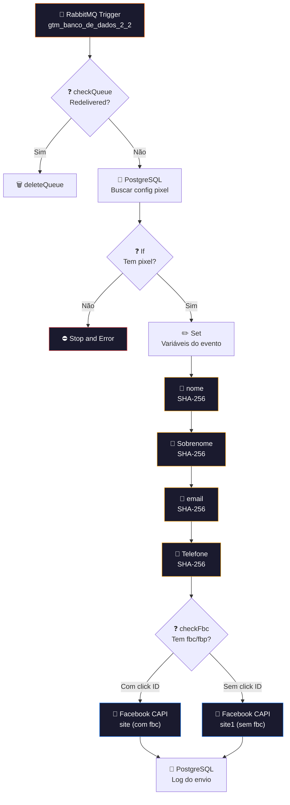

# 🎯 004.001 [3/3] — GTM Typeform: Disparo Pixel

!!! info "Visão Geral"
    Terceiro e último estágio do pipeline de tracking. Consome o payload enriquecido, busca a configuração do pixel do cliente, aplica hash SHA-256 nos dados pessoais (exigência CAPI) e dispara o evento de conversão para o Facebook via Conversions API. Tracking server-side que contorna bloqueio de ad blockers.

## Ficha Técnica

| Campo | Valor |
|:------|:------|
| **Nome** | 004.001 - [3/3] - Google Tag Manager - Typeform |
| **ID** | `cq6W0FsGX4IMNdtl` |
| **Instância** | `workflows.goldeletra.pro` |
| **Status** | 🟢 Ativo |
| **Nós** | 19 |
| **Trigger** | RabbitMQ — fila `gtm_banco_de_dados_2_2` |
| **Error Workflow** | `ByxX1TqYfyvlgp2T` |
| **Tags** | `OK`, `Cadastrado`, `Documentado` |

---

## Arquitetura



---

## Nós em Detalhe

### 1. RabbitMQ Trigger
Consome da fila `gtm_banco_de_dados_2_2` (publicada pela Parte 2).

### 2. checkQueue + deleteQueue
Padrão de dedup por `redelivered` (template 005.002).

### 3. PostgreSQL — Config do Pixel
**Credencial:** `Postgres - Metricas`

Busca a configuração do pixel Facebook do cliente: `pixel_id`, `access_token`, `api_version`.

### 4. If — Tem pixel?
Se o cliente não tem pixel configurado, dispara **Stop and Error** para encerrar a execução com erro explícito (registrado no error workflow).

### 5. Set — Variáveis do evento
Prepara todas as variáveis necessárias para o payload CAPI: `event_name`, `event_time`, `source_url`, `action_source`, versão da API, pixel ID.

### 6–9. Hash SHA-256 (4 nós Crypto)

A Facebook Conversions API exige que dados pessoais sejam hasheados antes do envio:

| Nó | Campo | Algoritmo |
|:---|:------|:----------|
| `nome` | Primeiro nome | SHA-256 |
| `Sobrenome` | Sobrenome | SHA-256 |
| `email` | Email | SHA-256 |
| `Telefone` | Telefone | SHA-256 |

!!! warning "Normalização"
    Antes do hash: lowercase, remover espaços, telefone no formato E.164. A CAPI rejeita dados mal normalizados silenciosamente.

### 10. checkFbc — Click Attribution
Verifica se o payload contém cookies `fbc` (Facebook Click ID) e `fbp` (Facebook Browser ID):

| Cenário | Rota | Qualidade |
|:--------|:-----|:----------|
| **Com `fbc`/`fbp`** | `site` | Atribuição direta (determinística) |
| **Sem `fbc`/`fbp`** | `site1` | Matching probabilístico |

### 11–12. Facebook Conversions API

```
POST https://graph.facebook.com/{version}/{pixel_id}/events
```

Envia o evento de conversão com os dados hasheados. A diferença entre `site` e `site1` é a inclusão dos campos `fbc`/`fbp` no payload.

### 13. PostgreSQL — Log
Registra o envio no banco para auditoria e análise de performance do tracking.

---

## Facebook Conversions API (CAPI)

### O que é?
API server-side do Facebook para enviar eventos de conversão diretamente do servidor, sem depender do pixel JavaScript no navegador.

### Por que usar?
- **Ad blockers** não afetam (evento sai do servidor, não do browser)
- **iOS 14+** restringiu cookies de terceiros — CAPI contorna
- **Deduplicação** com pixel browser via `event_id`
- **Melhor atribuição** → melhor otimização de campanha → menor custo por lead

### Payload enviado

```json
{
  "data": [{
    "event_name": "Lead",
    "event_time": 1708900000,
    "action_source": "website",
    "event_source_url": "https://clinica.com.br/formulario",
    "user_data": {
      "fn": "sha256(nome)",
      "ln": "sha256(sobrenome)",
      "em": "sha256(email)",
      "ph": "sha256(telefone)",
      "fbc": "fb.1.1234567890.ABCdef",
      "fbp": "fb.1.1234567890.1234567890"
    }
  }]
}
```

---

## Posição no Pipeline

```
[1/3] Receptor  →  [2/3] Enriquecimento  →  [3/3] Disparo Pixel
                                               ▲ VOCÊ ESTÁ AQUI
```

| Fila | Direção | Contraparte |
|:-----|:--------|:------------|
| `gtm_banco_de_dados_2_2` | ← Consome | Parte 2 publica |

---

## Credenciais

| Serviço | Credencial | Uso |
|:--------|:-----------|:----|
| RabbitMQ | `RabbitMQ` | Consumer |
| PostgreSQL | `Postgres - Metricas` | Config pixel + log |
| n8n API | `n8n account` | Auto-registro TrackAble (desabilitado) |

---

## Troubleshooting

| Problema | Causa | Solução |
|:---------|:------|:--------|
| Evento não aparece no Meta Events Manager | Pixel ID errado | Verificar config no PostgreSQL |
| Evento com "match quality" baixa | Dados mal normalizados antes do hash | Checar lowercase, trim, formato E.164 |
| Stop and Error disparou | Cliente sem pixel configurado | Cadastrar pixel no banco |
| CAPI retorna 403 | Access token expirado | Renovar no Facebook Business Manager |
| Atribuição fraca | Sem `fbc`/`fbp` | Normal para tráfego orgânico ou iOS — probabilístico |
| Duplicata no Events Manager | `event_id` não único | Verificar geração de ID no Code (Parte 2) |